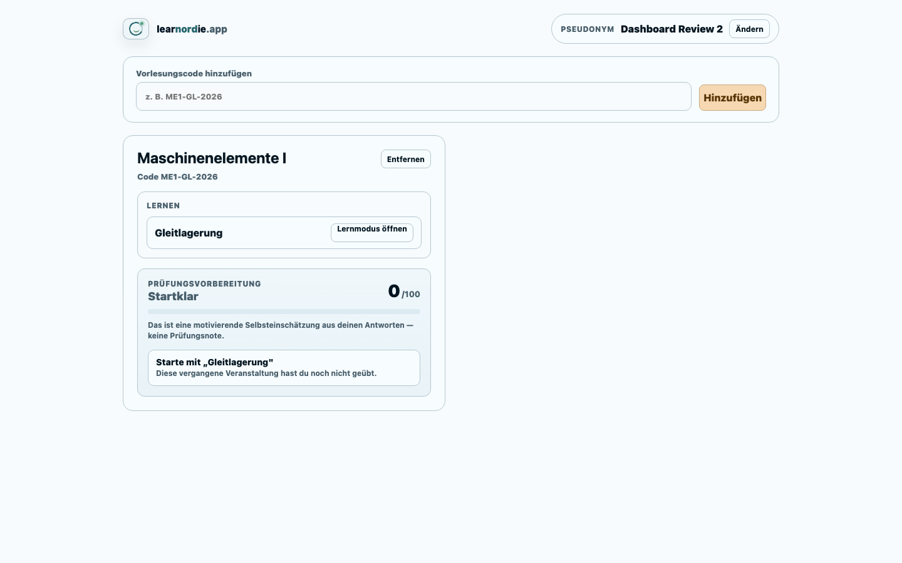
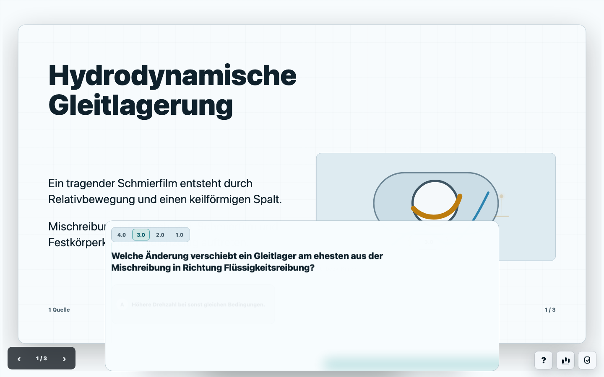
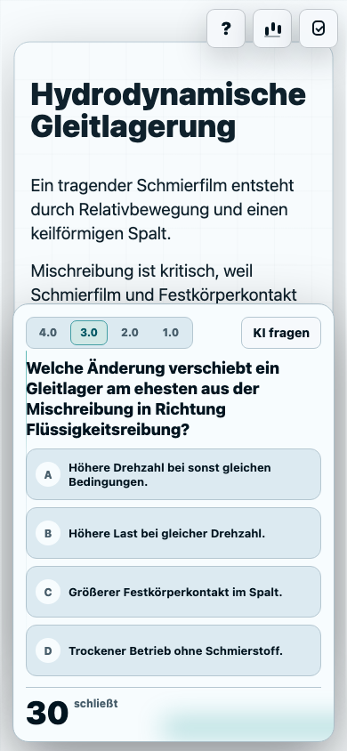
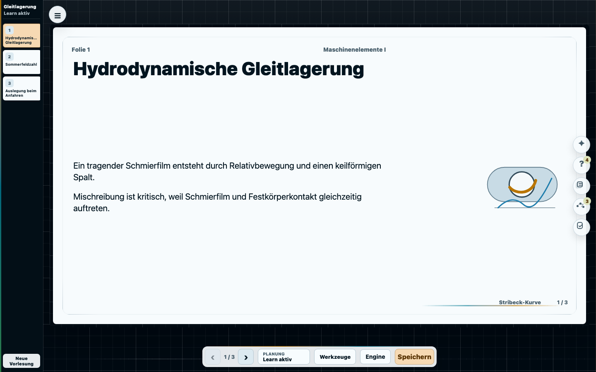
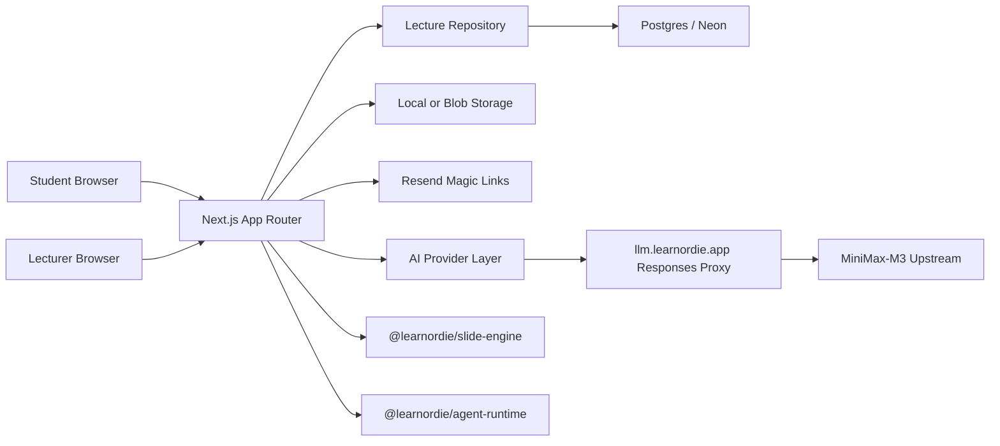

# learnordie.app

learnordie.app is a lecture augmentation platform for technical university courses. The official reading is **Lernen im Norden**. The sharper English reading remains a quiet domain easter egg; the product itself stays calm, precise, and study-focused.

The current reference course is **Maschinenelemente I: Gleitlagerung**.

[Live app](https://learnordie.app) · **[Project page with screenshots](docs/index.html)**

| Student Dashboard | Learn Mode |
|---|---|
|  |  |

| Mobile Learn | Lecturer Studio |
|---|---|
|  |  |

## What This App Does

learnordie.app turns a lecture deck into an interactive learning loop:

- Lecturers upload or prepare lecture material, build slide-based sessions, configure join codes, run live lectures, and review anonymous learning signals.
- Students join with a link or short code, choose a pseudonym, answer live questions, and keep using the Learn mode until the exam date.
- The platform generates and manages question families across four levels: `4.0`, `3.0`, `2.0`, `1.0`.
- Slides, questions, transcripts, chat questions, evaluation, analytics, AI help, and standalone export stay attached to the lecture object.

The product principle is: **slides first, tools second**. The presentation is the workspace. Tools open from the slide, not as disconnected admin pages.

## Core Flows

### Students

1. Open a lecture link or enter a join code such as `ME1-GL-2026`.
2. Choose a pseudonym. No student account is required.
3. Join a live lecture and answer timed questions.
4. Get immediate feedback after selecting an answer.
5. Revisit completed lectures in Learn mode with hotspots, adjustable question density, leaderboard, AI chat, and readiness feedback.

### Lecturers

1. Sign in with an email magic link.
2. Create and manage lecture series.
3. Upload sources: PowerPoint, PDF, URL, notes, and audio/transcript material.
4. Edit the lecture directly in a slide-first studio.
5. Prepare question variants, source notes, evaluation, and Learn mode behavior.
6. Run the live lecture and monitor transcript/STT status.
7. Export a standalone archive for long-term offline reuse.

## Architecture



### Stack

- Next.js App Router
- React 19
- TypeScript
- Postgres with Drizzle ORM
- Neon for managed Postgres
- Vercel for deployment
- Resend for lecturer magic links
- `@learnordie/slide-engine` as a private workspace package
- `@learnordie/agent-runtime` for the Pi-derived runtime integration
- Playwright for browser release gates

## Repository Layout

```text
src/app/                 Next.js routes and API endpoints
src/components/          Product UI: landing, live, learn, studio, drawers
src/server/              Repository, providers, auth, jobs, material processing
packages/slide-engine/   HTML slide document renderer and QA harness
packages/agent-runtime/  Agent runtime wrapper and tool contract
scripts/                 Admin, readiness, smoke, release, backup tools
docs/index.html          Public GitHub Pages project page
tests/e2e/               Playwright product and release gates
```

The slide engine is intentionally inside this monorepo. It is not a separate product repository, because app UI, persistence, standalone export, and engine evolution need to move together.

## Local Development

```bash
npm install
cp .env.example .env
npm run dev
```

The demo can run with the local repository mode for UI work. For Postgres-backed development:

```bash
LEARNBUDDY_REPOSITORY=postgres
DATABASE_URL=postgres://...
npm run db:migrate
npm run admin -- seed-demo --owner referent@example.test
```

The seed creates:

- lecture token: `gleitlagerung-demo`
- join code: `ME1-GL-2026`
- owner email: the value passed to `--owner`

## Useful Commands

```bash
npm run dev                  # local dev server
npm run build                # production build
npm run typecheck            # TypeScript
npm run lint                 # ESLint
npm run scripts:check        # operational script syntax and help contracts
npm run motion:contract      # UI motion contract
npm run test:slide-engine    # slide renderer QA matrix
npm run test:e2e             # full Postgres-backed Playwright gate
npm run deploy:readiness     # deployment configuration audit
npm run release:gate         # release gate wrapper
```

The default E2E config expects Postgres at `127.0.0.1:55432`. On machines with Postgres on port `5432`, run:

```bash
E2E_DATABASE_URL='postgres://michaelwelsch@127.0.0.1:5432/learnbuddy_e2e_smoke' npm run test:e2e
```

## Environment

Primary deployment target:

- app: `https://learnordie.app`
- LLM proxy: `https://llm.learnordie.app`
- Vercel
- Neon Postgres
- Resend
- server-side MiniMax-M3 Responses proxy
- STT provider such as Mistral Voxtral

Important environment groups:

- Runtime: `NEXT_PUBLIC_APP_URL`, `LEARNBUDDY_DEPLOYMENT_ENV`, `AUTH_SECRET`
- Database: `DATABASE_URL`, `LEARNBUDDY_REPOSITORY`
- Mail: `LEARNBUDDY_MAIL_PROVIDER`, `RESEND_API_KEY`, `EMAIL_FROM`
- AI proxy: `LEARNBUDDY_AI_PROVIDER=learnordie-responses`, `LEARNORDIE_LLM_PROXY_API_KEY`
- MiniMax upstream: `LEARNORDIE_MINIMAX_API_KEY` or `MINIMAX_API_KEY`
- STT: `LEARNBUDDY_STT_PROVIDER`, `MISTRAL_API_KEY` or `LEARNBUDDY_STT_API_KEY`
- Storage: `LEARNBUDDY_STORAGE_PROVIDER`, Blob or object storage credentials

Operational runbooks, agent working notes, roadmap drafts, deployment checklists, and internal review documents are intentionally not part of the public repository surface.

## Production Readiness

Production-ready means browser flows pass in a clean profile. Build success alone is not enough.

Current release gates cover:

- lecturer magic-link login, reload, logout, and protected route blocking
- student pseudonymous onboarding, join code, live participation, instant feedback, leaderboard
- Learn mode density, KI chat link, mobile fit, export link, leaderboard
- slide engine desktop, tablet, mobile, overflow, standalone export, unsafe HTML rejection
- material upload and extraction for PDF/PPTX text
- provider, deployment, storage, worker, backup/restore, and retention checks
- motion contract for route covers, drawers, shared elements, and studio sheets

## Privacy Model

- Students participate with pseudonyms.
- Learning analytics are anonymous by design.
- Lecturer access uses magic links.
- AI calls go through server-side provider/proxy layers. API keys are not exposed to browsers.
- Retention defaults to five years for analytics/course operation, with cleanup support.

## GitHub Pages

The only public project page in the repository is:

```text
docs/index.html
```

Enable GitHub Pages for the repository and choose `docs/` as the source directory.
