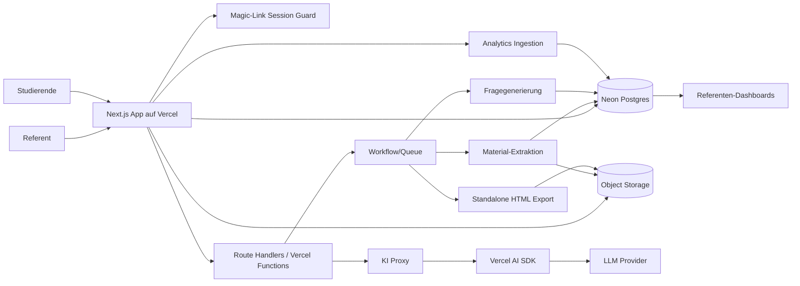

# LearnBuddy Platform: Fahrplan, Featureliste und Systemarchitektur

Stand: 19. Juni 2026

## 1. Zielbild

LearnBuddy ist eine Plattform für quiz-augmentierte Hochschulvorlesungen. Ein Referent plant Vorlesungsreihen, lädt Materialien hoch, lässt daraus didaktisch abgestufte Fragen erzeugen und nutzt die Präsentation live im Hörsaal. Studierende beantworten Fragen während der Live-Vorlesung, nutzen danach einen interaktiven Learn-Modus bis zum Prüfungsdatum und können zusätzlich ein langfristig nutzbares Standalone-HTML-Archiv herunterladen.

Das System soll nicht nur Quizfragen anzeigen, sondern einen Qualitätsregelkreis für Lehre schaffen:

1. Materialien und Live-Transkript erzeugen Fragen und Erklärungen.
2. Studierende beantworten Fragen und nutzen den KI-Assistenten.
3. Analytics zeigen Verständnislücken, Schwierigkeitsgrad, Engagement und Themencluster.
4. Referenten verbessern Folien, Fragen, Tempo und Evaluation.
5. Die nächste Durchführung startet mit besseren Materialien.

## 2. Kernrollen

### Referent

- Login und Profilverwaltung.
- Vorlesungsreihen erstellen und verwalten.
- Einzelne Vorlesungen planen.
- Materialien hochladen: PowerPoint, PDF, URLs, Notizen, Transkript.
- Mit einem Planungsassistenten über Inhalte, Lernziele, Fragen und didaktische Varianten chatten.
- Präsentationsmodus starten.
- Live-Fragen auslösen, pausieren, überspringen.
- Live-Feedback, Antwortverteilung und Verständnisrisiken sehen.
- Nach der Vorlesung Analytics und Evaluation auswerten.

### Studierende

- Zugang über Link oder QR-Code zur konkreten Vorlesung.
- Keine Account-Hürde: Ein Link reicht.
- Studierende geben optional ein Pseudonym ein und werden explizit aufgefordert, keinen Klarnamen zu verwenden.
- Live-Fragen beantworten.
- Eigenes Niveau wählen: 4.0, 3.0, 2.0, 1.0.
- Punkte und Feedback sehen.
- Learn-Modus nach der Vorlesung bis Prüfungsdatum nutzen.
- KI-Assistenten im Learn-Modus nutzen, solange die Freischaltung gilt.
- Standalone-HTML-Export herunterladen.

### Plattform-Admin

- Mandanten, Referenten, Limits und Missbrauch überwachen.
- Kosten, Tokenverbrauch, Uploadspeicher und Jobs kontrollieren.
- Datenaufbewahrung, Löschung und Export verwalten.

## 3. Produktmodule

### 3.1 Auth und Mandantenfähigkeit

- Referenten-Login über eigenen serverseitigen Magic-Link-Flow, initial per E-Mail Magic Link über Resend.
- Rollen: `admin`, `lecturer`, `student_session`.
- Mandant pro Hochschule/Fachbereich optional vorbereiten.
- Geschützte Referentenbereiche über Next.js Proxy/Middleware.
- Studentenzugang über signierte Lecture Links:
  - `lecture_public_token`
  - Ablaufdatum
  - optionales Pseudonym
  - pseudonyme Wiedererkennung per Cookie oder localStorage
  - keine Klarnamenpflicht

Aktueller Umsetzungsstand im MVP: Der Referentenlogin nutzt einen provider-neutralen `MailProvider`. Lokal kann der Console-Mailmodus einen klickbaren Testlink anzeigen, damit Playwright und Entwicklung ohne Mailbox funktionieren. Im externen Mailmodus und im Resend-Pfad wird der Magic Link nur über den Provider ausgeliefert und nicht an den Browser zurückgegeben. Bei gesetzter `DATABASE_URL` werden Magic Links zusätzlich als SHA-256-Hash in `magic_login_tokens` persistiert und beim ersten erfolgreichen Login mit `consumed_at` verbraucht; Wiederverwendung desselben Links wird abgewiesen. Zusätzlich begrenzt `magic_login_rate_limits` Magic-Link-Anfragen pro normalisierter E-Mail über einen HMAC-gehashten Bucket; die API liefert bei Missbrauch 429 mit `retry-after`, der Formularflow bleibt mit `rate-limited` neutral. Echte Production-Deployments werden über `VERCEL_ENV=production` oder `LEARNBUDDY_DEPLOYMENT_ENV=production` hart abgesichert: Platzhalter- oder kurze `AUTH_SECRET`-Werte, fehlende `DATABASE_URL`, Console-Mailprovider, Blackhole-Mailprovider und Resend ohne `EMAIL_FROM` werden blockiert; Magic-Link-Routen zeigen in diesen Fällen nur eine neutrale Sendefehlermeldung und keinen Testlink. `NEXT_PUBLIC_APP_URL` oder `VERCEL_URL` werden für Magic Links auf eine kanonische HTTP(S)-Origin normalisiert; Production bricht ohne gültige kanonische URL ab, und Fallbacks aus `Host`, `x-forwarded-host`, `x-forwarded-proto`, `request.url` oder `Origin` sind nur validierte lokale Entwicklungsfallbacks. Secure-Cookies fallen in Preview/Production bei ungültiger URL-Konfiguration nicht mehr auf `secure=false` zurück. Logout löscht das Session-Cookie explizit mit `path=/`. Referenten-Listen, Bearbeitung, Materialaktionen, Transcript-Aktionen und Analytics-Aggregate sind nach der E-Mail des eingeloggten Referenten gescoped; fremde Vorlesungs-IDs liefern 404. Öffentliche Studentenzugänge bleiben weiter link- und tokenbasiert ohne Account-Hürde. Der neue `npm run provider:smoke`-Befehl kann Resend aktiv prüfen, sobald verifizierte Domain, realer `RESEND_API_KEY`, `EMAIL_FROM` und `LEARNBUDDY_PROVIDER_SMOKE_EMAIL` gesetzt sind.

### 3.2 Vorlesungsverwaltung

- Vorlesungsreihe: z. B. "Maschinenelemente I".
- Vorlesung: z. B. "Gleitlagerung".
- Termine:
  - Live-Datum
  - Prüfungsdatum
  - KI-Zugriff aktiv bis
  - Learn-Modus aktiv bis
- Statusmodell:
  - `draft`
  - `material_processing`
  - `question_review`
  - `ready_for_live`
  - `live`
  - `learn_active`
  - `archived`

### 3.3 Material-Upload und Inhaltsverarbeitung

Unterstützte Quellen:

- PowerPoint/PPTX
- PDF
- URL/Webseiten
- manuelle Notizen
- Live-Transkript
- Chatfragen der Studierenden

Alle hochgeladenen Materialien dürfen vollständig für Verarbeitung, Fragegenerierung, Embeddings, HTML-Resynthese und Standalone-Export verwendet werden.

Pipeline:

1. Upload in Objekt-Storage.
2. Metadaten in Postgres.
3. Extraktion:
   - Slides, Texte, Bilder, Tabellen.
   - PDF-Seiten.
   - URL-Snapshots.
4. Chunking nach Folie, Abschnitt, Zeitmarke und Lernziel.
5. Embeddings in Postgres via `pgvector`.
6. Fragegenerierung in vier Niveaus.
7. Referentenreview mit Annahme, Bearbeitung, Sperrung.

### 3.4 Fragegenerator

Jede Frage wird als Variantenfamilie gespeichert:

- Niveau 4.0: Begriff und Zuordnung.
- Niveau 3.0: Anwendung im bekannten Kontext.
- Niveau 2.0: Erklärung von Zusammenhängen.
- Niveau 1.0: Transferleistung in neuem Kontext.

Jede Variante enthält:

- Frage
- 4 Antwortoptionen
- korrekte Antwort
- kurze Erklärung
- Quelle: Folie, Chatfrage, Transkriptstelle, URL
- Schwierigkeitsniveau
- erwarteter Lernzielbezug
- Qualitätsstatus: `draft`, `reviewed`, `approved`, `rejected`

Wichtig: Im Zielprodukt muss nicht jede KI-generierte Frage vorab durch den Referenten freigegeben werden. Die KI wählt selbstständig aus dem gesamten verfügbaren Fragepool aus:

- Folien und Materialien.
- Live-Transkript.
- sinnvolle Studierendenfragen.
- bereits generierte Varianten.

Unklare, nicht zielführende oder fachlich irrelevante Studierendenfragen werden ignoriert oder nur als schwaches Signal gespeichert.

### 3.5 Live-Präsentationsmodus

Referentenansicht:

- Vollbildnahe Präsentation.
- Foliennavigation.
- Frage-Drawer per Space oder Icon.
- Anzeige der vier Fragevarianten ohne Antworten.
- Live-Status:
  - aktive Frage
  - verbleibende Zeit
  - Antwortquote
  - Antwortverteilung
  - häufige Chatfragen
  - Verständnisrisiko pro Thema

Studentenansicht:

- Link/QR-Code öffnet Live Lecture Session.
- Optionales Pseudonym statt Account.
- Frage erscheint als Drawer.
- Niveau frei wählbar.
- Countdown schließt Frage, Auswahl zeigt sofort Feedback.
- Leaderboard optional und pro Vorlesung durch den Referenten steuerbar.
- Chatfragen an Referenten oder in Moderationsqueue.

### 3.6 Learn-Modus

- Nach Live-Ende automatisch aktiv.
- Folien mit Frage-Hotspots.
- Fragedichte steuerbar.
- Wiederholen nach Niveau.
- KI-Assistent pro Frage und pro Folienabschnitt.
- Fortschritt:
  - beantwortete Fragen
  - korrekte Antworten
  - Schwächen pro Thema
  - empfohlene Wiederholungen
- KI-Zugriff bis Prüfungsdatum oder manuell gesetztem Ablauf.

### 3.7 Standalone-HTML-Export

Ziel: Auch in 20 Jahren ohne Server lauffähig.

Exportinhalt:

- Folien als HTML/CSS/JS.
- Audiospur des Dozenten.
- Fragen und Antwortlogik als eingebettetes JSON.
- Erklärungen und Musterlösungen lokal eingebettet.
- Keine externen CDN-Abhängigkeiten.
- Keine serverseitige KI.
- Optional: statisch generierte KI-Erklärungen aus dem Zeitpunkt des Exports.
- Export-Metadaten:
  - Vorlesungsname
  - Exportdatum
  - Version
  - Lizenz/Urheberhinweise
  - Prüfsumme

Einschränkungen:

- Kein Live-Leaderboard.
- Kein serverseitiger KI-Chat.
- Keine Synchronisation oder Analytics.
- Keine Notwendigkeit für lokale Fortschrittsdaten im MVP.

Aktueller Umsetzungsstand im MVP: Die Export-Route erzeugt eine versionierte self-contained Standalone-HTML-Datei mit Export-Metadaten, Payload-SHA-256, Response-SHA-256-Header, Manifest-SHA-256-Header, statisch gerenderten Folien, statisch gerenderten Fragen, eingebettetem `learnbuddy-data`, eingebettetem `learnbuddy-manifest`, Asset-Prüfsummen, `externalAssetCount=0`, Data-URI-Audio-Fallback und lokaler Quizantwortlogik ohne Server. Das einzelne Offline-HTML deklariert inzwischen eine `WCAG 2.2 AA baseline` für den MVP und enthält Skip-Link, semantische Landmarken, sichtbaren Fokus, ARIA-Live-Feedback und Tastaturnavigation für Antwortoptionen. Zusätzlich gibt es ein versioniertes Archiv-ZIP `standalone-archive-v1` mit `index.html`, `learnbuddy-manifest.json`, `learnbuddy-data.json`, `assets/styles.css`, `assets/standalone.js` und echten hochgeladenen Dozentenaudio-Dateien als `audio/*`; Manifest und Daten enthalten Pfad, Mime-Type, Bytezahl, Quelle und SHA-256 pro Audiodatei. Bei PCM-WAV-Audio erzeugt das Archiv zusätzlich pro Folie ein Segment unter `audio/segments/`; Manifest und Daten enthalten dazu `slideIndex`, `sourcePath`, Start-/Endzeit, Bytezahl und SHA-256. Referenten können ein Archiv zusätzlich über eine authentifizierte Action als Storage-Artefakt speichern; `standalone_exports.storage_url` zeigt lokal auf `/api/local-artifacts/...` oder bei Remote-Storage auf `/api/storage-artifacts/...`, und das Dashboard bietet nach Reload `Gespeicherten Stand laden` an. Dieser Speichern-Flow legt zusätzlich einen persistierten Archivjob in `standalone_export_jobs` an, setzt Status, Format, Start-/Endzeit, Dauer, Artefakt-URL, SHA und verweist bei Erfolg auf den finalen `standalone_exports`-Datensatz. Der Archivlauf wird inzwischen über einen providerneutralen `JobProvider` ausgeführt; lokal nutzt er `provider=inline`, der portable HTTP-Pfad registriert Jobs serverseitig bei einem Broker mit `provider=http`, und `provider=database` legt Jobs als Postgres-Queue an, die `/api/jobs/worker` per Secret atomar claimt und außerhalb des Referentenrequests ausführt. Database Worker-Jobs speichern Versuchszähler, maximale Versuche, nächsten Versuch und Dead-Letter-Zeitpunkt; Fehlkonfigurationen werden erst wiederholt und danach als `dead_letter` mit sicherer UI-Meldung angezeigt. Für Vercel ist zusätzlich `GET /api/jobs/worker/cron` in `vercel.json` als Fünf-Minuten-Cron registriert; der Endpunkt akzeptiert `CRON_SECRET` oder das portable Worker-Secret und ruft denselben Queue-Runner auf. Storage ist ebenfalls providerneutral: lokal Filesystem, produktionsnah `vercel-blob` über `@vercel/blob`, self-hosting-tauglich `http` über PUT/GET-Object-Store hinter der App-Proxy-Route. Der öffentliche Preview-Smoke vom 19. Juni 2026 hat diesen Pfad gegen Vercel/Neon/Vercel Blob live geprüft: unauthentifizierter Worker-Zugriff 401, database Worker-Job `succeeded`, gespeichertes ZIP über `/api/storage-artifacts/vercel-blob/...` mit `application/zip`, 102961 Bytes und passender SHA-256-Prüfsumme.

### 3.8 KI-Assistent und Vercel Proxy

API-Ziel:

- `/api/ai/chat`
- Authentifizierung über Student Session oder Referenten-Session.
- Prüfung:
  - Lecture-Zugang gültig?
  - KI-Zugriff bis einschließlich Prüfungstag aktiv?
  - Nutzung im Übungs-/Learn-Kontext?
  - Rate Limit eingehalten?
  - Materialfreigabe vorhanden?
- Kein API Exposure: Der Client spricht nur mit dem eigenen Proxy, nie direkt mit Modell-APIs.
- Zweckbindung: Prompts werden auf den Vorlesungs- und Übungskontext eingeschränkt.
- Retrieval:
  - aktuelle Folie
  - Frage
  - relevante Material-Chunks per Vektor- oder Volltextsuche
  - optional persönliche Fehlermuster
- Antwortstream zurück an Client.
- Logging:
  - Tokenverbrauch
  - Latenz
  - genutzte Quellen
  - Fehler
  - Abuse-Signale

Der Proxy muss alle Modell-Keys serverseitig halten. Clients bekommen nie Provider-Schlüssel.

Der KI-Loop soll als eigener Proxy plus Agent-SDK-Loop entworfen werden. Dadurch bleibt die Plattform unabhängig von einem einzelnen LLM-Anbieter und kann später selbst gehostete Modelle oder andere Agent-Runtimes verwenden.

Aktueller Umsetzungsstand im MVP: `/api/ai/chat` läuft über einen eigenen serverseitigen Proxy und prüft `ai_access_until`, so dass der KI-Assistent nach Ablauf des Prüfungstags keine Antwort mehr liefert. Der Proxy begrenzt den Requestkörper vor dem JSON-Parse und erzwingt vor Retrieval, Modellaufruf und Budgetverbrauch zusätzlich eine fachliche Zweckbindung: Freitextfragen werden gegen Vorlesungstitel, Folien, aktive Fragen, Antworten, Erklärungen, Materialbezüge und technische Domänenbegriffe geprüft; klar fachfremde Anfragen wie `Wie backe ich Pizza?` werden mit HTTP 403 und sichtbarem Scope-Hinweis verweigert. Jede Scope-Blockierung wird als `ai_chat_blocked` mit `reason=scope`, `scopeReason`, `matchedTerms` und `offTopicTerms` protokolliert. Der Proxy erzwingt außerdem ein pro Vorlesung, pro Vorlesungsreihe und pro Konto konfigurierbares Tageslimit sowie ein pro Vorlesung, pro Vorlesungsreihe und pro Konto konfigurierbares Tokenbudget. Vorlesungs- und Reihenlimits gelten pro pseudonymer Learn-Sitzung, das Kontolimit gilt kontoübergreifend über alle heutigen Learn-Anfragen. Für erlaubte Antworten ruft der Proxy relevante Material-Chunks aus `asset_chunks` über pgvector-Ranking ab, gibt Quellen an die UI zurück und speichert Token-, Quellen- und Retrievalmetadaten in Analytics-Events. Der Learn-Modus fordert Antworten mit `stream=true` an, verarbeitet `application/x-ndjson`-Events, baut die Antwort inkrementell auf und übernimmt Quellen sowie Restbudget aus dem finalen `done`-Event. Der Chat-Provider ist providerneutral gekapselt und liefert bevorzugt einen nativen SSE-Stream vom Modellprovider, bevor LearnBuddy daraus NDJSON für den Browser macht. Produktiv ist `LEARNBUDDY_AI_PROVIDER=ctox-responses` der bevorzugte Pfad zum bestehenden CTOX/OpenAI-Responses-Proxy `https://llm.ctox.dev/v1/responses`; der ältere `LEARNBUDDY_AI_PROVIDER=openai-compatible`-Adapter für `/v1/chat/completions` bleibt als Fallback erhalten. LearnBuddy nutzt dafür nur serverseitig `LEARNBUDDY_LLM_PROXY_*` oder die kompatiblen `CTOX_LLM_PROXY_*`-Variablen; der Browser sieht weiterhin ausschließlich den eigenen `/api/ai/chat`-Proxy und nie das tenant-scoped `ctox_llm_...`-Token. Das Browserpanel trägt nach einer Antwort nur nicht geheime Provider-Metadaten (`data-ai-provider`, `data-ai-model`, `data-ai-stream-source`, `data-ai-answer-state`), damit `smoke:live --include-ai --require-ai-provider` den echten Provider-Stream prüfen kann, ohne API-Keys offenzulegen. Embeddings sind ebenfalls providerneutral gekapselt: lokal deterministisch für Tests oder serverseitig OpenAI-kompatibel über `LEARNBUDDY_EMBEDDING_PROVIDER=openai-compatible`, ohne Embedding-URL oder API-Key an den Browser zu leaken. Antwortevents speichern Provider, Modell, `streaming=true`, `streamSource=provider`, echte Provider-Usage falls vorhanden, Reihen- und Kontolimits sowie eine providerneutral berechnete `costEstimate`; die Aggregates-API verdichtet daraus Input-/Output-Tokens, geschätzte EUR-Kosten, Kostenmodell und Warnstatus aus den gespeicherten Events. Fehlkonfigurationen liefern dem Client nur neutrale Meldungen und werden intern als `ai_chat_blocked.reason=provider_config` beziehungsweise als fehlgeschlagener Materialverarbeitungslauf protokolliert. Das Referenten-Dashboard aggregiert KI-Öffnungen, KI-Fragen, blockierte Anfragen, Tokenverbrauch, Quellenanzahl, letzte KI-Frage und Kostenwarnungen; in der Planungsansicht kann der Referent KI-Limits getrennt für die einzelne Vorlesung, die ganze Reihe und das Konto setzen. Der foliennahe Referenten-Assistent kann den provider-validierten Toolplan serverseitig als CSRF-geschützte Kette aus `source_note`, `slide_point`, `review_draft` und `evaluation_focus` ausführen, ohne dass der Browser Toolreihenfolge oder Tooltypen vertrauenswürdig vorgeben darf. `review_draft` nutzt bei aktivem AI-Fragegenerator denselben AIProvider-Fragegeneratorpfad wie Materialquellen. Offen bleiben der authentifizierte Live-Smoke mit echtem `ctox_llm_...`-Token, authentifizierter Live-Smoke mit echtem Embedding-Provider, echte Provider-Abrechnung und weitere Toolklassen im Agent-Loop.

### 3.8.1 Realtime-STT für Live-Transkript

Das Live-Transkript wird als eigenes Modul gebaut:

- Der Dozent gibt im Browser das Mikrofon frei.
- Der Browser streamt Audio an einen STT-Endpunkt.
- Als Zielmodell ist Voxtral Realtime von Mistral vorgesehen.
- Die Dozentenansicht zeigt sichtbar:
  - Transkript läuft.
  - Transkript pausiert.
  - Verbindungsfehler.
  - letzte erkannte Passage.
- Der Referent kann das Transkriptpanel ein- und ausblenden.
- Transkriptsegmente fließen als Quelle in den Fragepool.
- Das System darf daraus selbstständig passende Fragen synthetisieren.

Architekturhinweis: Mistral beschreibt Voxtral Realtime als Streaming-STT mit sehr niedriger Latenz und offenen Gewichten; die Implementierung sollte trotzdem über ein internes STT-Adapter-Interface laufen, damit später zwischen Mistral-API, selbst gehostetem Voxtral/vLLM und anderen STT-Providern gewechselt werden kann.

Aktueller Umsetzungsstand im MVP: Die Dozenten-Live-Ansicht fordert im Browser Mikrofonfreigabe an, hält einen echten `MediaStream`, zeichnet kurze Passagen bevorzugt als PCM16-WAV über Web Audio auf, fällt bei Bedarf auf `MediaRecorder` zurück und sendet den Audio-Blob an den eigenen authentifizierten STT-Proxy `/api/lectures/:id/stt`. Der Proxy kapselt den `STTProvider`, gibt Transkript, Providername, Konfidenz, Mime-Type und Audio-Bytezahl zurück und leakt keine Provider-Schlüssel an den Client. Lokal bleibt der deterministic `voxtral-realtime`-Fallback für Tests aktiv. Für Production kann `LEARNBUDDY_STT_PROVIDER=mistral-voxtral` gesetzt werden; dann ruft der Server Mistral/Voxtral per Multipart `POST /v1/audio/transcriptions` mit `MISTRAL_API_KEY`, Modell, Sprache, optionalem Kontextbias und Timeout auf. Für Self-Hosting kann stattdessen `LEARNBUDDY_STT_PROVIDER=self-hosted-vllm` mit `LEARNBUDDY_STT_BASE_URL` und `LEARNBUDDY_STT_API_KEY` auf einen OpenAI-kompatiblen `/v1/audio/transcriptions`-Endpunkt zeigen. Optional gibt es `LEARNBUDDY_STT_PROVIDER=self-hosted-vllm-realtime|vllm-realtime|openai-realtime`: Der Server spricht dann `LEARNBUDDY_STT_REALTIME_BASE_URL` oder `LEARNBUDDY_STT_BASE_URL` als `/v1/realtime`-WebSocket, sendet PCM16/WAV-Segmente über `input_audio_buffer.append`/`commit` und sammelt Transcript-Events. Der Referent sieht `Browser-Mikrofon streamt`, `STT-Proxy transkribiert`, die letzte Passage, Konfidenz und Audio-Bytes. Neben einer manuellen Passage gibt es eine automatische Segmentierung: der Browser nimmt fortlaufend kurze Segmente auf, stellt bis zu vier STT-Kandidaten in einer kompakten Liste bereit und persistiert erst nach bewusster Übernahme in `transcript_segments`; bei Fachbezug entsteht daraus ein `Transkript:`-Review-Kandidat. Offen bleiben durchgehend bidirektionale Browser-zu-Provider-Realtime-Relays ohne segmentierten Proxy-Hop sowie echte STT-Live-Smokes mit produktiven Mistral- oder Self-Hosted-vLLM-Werten.

### 3.9 Analytics und Qualitätsregelkreis

Eventdaten:

- Lecture geöffnet.
- Slide angezeigt.
- Frage geöffnet/geschlossen.
- Niveau gewechselt.
- Antwort ausgewählt.
- Ergebnis.
- Zeit bis Antwort.
- KI-Chat geöffnet.
- KI-Frage gestellt.
- Leaderboard geöffnet.
- Learn-Modus-Sitzung.
- Standalone-Export erzeugt.
- Evaluation beantwortet.

Die Analytics-Erfassung ist pseudonym. Es werden keine Klarnamen für Studierende benötigt. Der Default ist Analyse auf Sitzungs-, Kohorten-, Vorlesungs- und Themenebene.

Aggregationen:

- Antwortquote pro Frage.
- Korrektquote pro Niveau.
- Themen mit niedriger Transferleistung.
- Fragequalität: zu leicht, zu schwer, missverständlich.
- Drop-off im Learn-Modus.
- KI-Nutzung pro Thema.
- Evaluation gegen Lernverhalten.

Qualitätsregelkreis:

1. Analytics Dashboard zeigt Problemstellen.
2. Assistent schlägt bessere Folienfragen vor.
3. Referent akzeptiert oder bearbeitet Vorschläge.
4. Nächste Durchführung nutzt verbesserte Fragen.
5. Evaluation prüft, ob sich Lern- und Verständniswerte verbessern.

Aktueller Umsetzungsstand im MVP: Teilnahme- und Antwortevents werden pseudonym persistiert und im Referenten-Dashboard zu Teilnehmenden, Antwortquote, Korrektquote und Niveau-Breakdown verdichtet. Der öffentliche Pfad ist auf `POST /api/events` für allowlistete Studentensignale begrenzt; unbekannte Eventtypen, zu große Events und öffentliche `GET`-Debug-Dumps werden abgelehnt. Antwortevents werden gegen die gespeicherten Vorlesungsfragen validiert, so dass `correct`, `points`, `earnedPoints`, Frage- und Antworttexte serverseitig gesetzt werden und manipulierte Browser-Punkte nicht ins Leaderboard eingehen. Das Dashboard zeigt daraus eine erste Fragequalitätskarte mit Korrektquote, häufiger falscher Antwort und Prioritätsempfehlung. Der Analytics-Zeitverlauf verdichtet Events in Minuten-Buckets und zeigt Teilnahmen, Antworten, Korrektquote, KI-Fragen und Evaluationen pro Abschnitt. Zusätzlich bündeln Themencluster Signale aus falschen Antworten, KI-Fragen und Evaluationen, priorisieren Risikothemen wie `Mischreibung und Verschleiß` und zeigen Evidenz sowie eine Verbesserungsempfehlung. Der Reihenverlauf vergleicht mehrere Vorlesungen derselben Vorlesungsreihe nach Teilnehmenden, Antworten, Korrektquote, KI-Fragen, Evaluationen und Top-Risikothema und gibt eine einfache Trendempfehlung aus. Aus diesen Signalen erzeugt das Dashboard inzwischen automatische Verbesserungsvorschläge mit Priorität, Evidenz und konkreter nächster Aktion, zum Beispiel für Verständnis, Folienübergang, Fragequalität und Tempo. Zusätzlich entstehen daraus übernehmbare Änderungsentwürfe für Folien und aktive Fragen: Der Referent sieht Vorher/Nachher, übernimmt den Entwurf, und die Änderung wird in der bestehenden Folien- oder Fragenpersistenz gespeichert. Jede Übernahme schreibt ein `improvement_draft_applied`-Event mit Art, Ziel, Referentenkennung und strukturierten Diff-Feldern; Folienänderungen enthalten etwa `Folientext`, Fragenänderungen getrennt `Fragetext`, `Korrekte Antwort`, geänderte Ablenker und `Erklärung`. Das Dashboard zeigt daraus den Verlauf `Übernommene Änderungen` und misst im `Wirksamkeitsvergleich` Antwortdaten vor und nach übernommenen Fragenänderungen mit Delta, Status und Empfehlung. `participant_sessions` sind pro Vorlesung und Anonymous Key eindeutig, damit schnelle Join-/Antwortevents keine doppelten Sitzungen erzeugen. Zusätzlich gibt es einen WYSIWYG-Evaluation-Builder, der die Learn-Modus-Evaluation als Vorschau direkt editierbar macht. Referenten können diese Evaluation pro Vorlesung speichern oder als Vorlage für die ganze Vorlesungsreihe übernehmen; neue Vorlesungen derselben Reihe erben dann Titel, Intro, Metriklabels, Freitextlabel, Buttontext und Aktivstatus. Änderungen an der Evaluation erhöhen eine Version in `evaluation_config`; Learn-Evaluation-Events speichern `evaluationVersion`, und das Dashboard zeigt die Rückmeldungen getrennt nach Versionsstand. Das Referenten-Dashboard ist als Studio mit sichtbarer Vorlesungsfläche aufgebaut; alle cookie-authentifizierten Schreibaktionen des Dashboards und des Dozenten-Live-Modus verlangen ein signiertes, sessiongebundenes CSRF-Token. Der Präsentationsmodus ist inzwischen ein fullscreen-naher WYSIWYG-Folieneditor ohne permanente Kopfzeile, ohne permanente rechte Inspector-Spalte und ohne dauerhafte Planleiste. Desktop zeigt wieder eine visuelle Folienleiste wie ein Deck-Editor, weil der Referent sonst zu wenig WYSIWYG-Orientierung hat; Mobile blendet diese Leiste aus. Globale Aktionen, Vorlesungswechsel, Export, Archiv und Logout liegen in einem kleinen Burger-Menü mit Vorlesungs-Deckkarten statt Selectbox; Status, Live-Termin, Prüfungstag, Rangliste und KI-Limits öffnen sekundär als kompakter Planungs-Popover direkt aus dem jeweiligen Plan-Chip. Folientitel, Copy, Thema und Diagramm lassen sich direkt auf dem Slide bearbeiten und persistieren. Fragen, Evaluation, Auswertung, Quellen und der Referenten-Assistent liegen als lesbare Objektaktionen direkt auf der Folie (`Assistent`, `Fragen`, `Quellen`, `Lernstand`, `Evaluation`) und öffnen als Layer direkt auf der sichtbaren Folie statt als rechte Kontextleiste oder scrollbare Formularliste. Fragen erscheinen als Live-Quizkarte mit lesbaren Antwortkarten, Evaluation erscheint als Learn-Modus-Vorschau, Auswertung als kompakter Zahlen-/Signal-Layer, Quellen als Materialanker mit Datei/Link/Notiz-Composer mit jeweils nur einem sichtbaren Eingabemodus und der Assistent als foliennaher Chat zu Lernzielen und 4.0/3.0/2.0/1.0-Fragevarianten. Assistentennachrichten werden in `lecturer_assistant_messages` mit Lecture-, Slide-, Rollen-, Quellen-, Timestamp- und strukturierten Agent-Metadaten persistiert; `metadata_json` enthält Provider, Modell, Agent-Run, Agent-Schritte, Quellengewichtung, Toolvorschläge und einen validierten Toolplan mit Reihenfolge, Status und Voraussetzung. Der Assistent kann optional über `LEARNBUDDY_LECTURER_ASSISTANT_PROVIDER=ai` denselben serverseitigen AIProvider/CTOX-Responses-Pfad nutzen wie Learn-KI, Chatmoderation und Fragegenerierung; in diesem Modus holt er zusätzlich eine strukturierte JSON-Toolplanung vom Provider und fällt bei Fehlern kontrolliert auf den lokalen Planungsagenten zurück. Die aktuelle Toolkette aus `source_note`, `slide_point`, `review_draft` und `evaluation_focus` kann direkt aus dem Assistenten-Overlay ausgeführt werden; der Server lädt dafür den zuletzt persistierten validierten Toolplan, begrenzt die Kette, dedupliziert Tooltypen und schreibt alle Änderungen über dieselben Owner-gescopten Repository-Grenzen wie die Einzelaktionen. `review_draft` erzeugt seine 4.0/3.0/2.0/1.0-Varianten bei aktivem AI-Fragegenerator über denselben `generateQuestionVariantsForMaterial`-/AIProvider-Pfad wie Materialquellen, nicht über lokale Platzhalter. `evaluation_focus` richtet die Learn-Modus-Evaluation folienbezogen aus und öffnet anschließend dieselbe WYSIWYG-Evaluation auf der Folienbühne. Frische Referentenaccounts und `Neue Vorlesung` starten direkt auf einer großen editierbaren Folienbühne statt auf einer Verwaltungs-Zwischenfläche oder in einem kleinen Popover. Technische Prompt-, Registry- und Providerdetails tragen nicht die primäre UI. Auf 390px Mobile sind Folienminiaturen ausgeblendet; Stepper, Planung und Speichern bleiben viewportgebunden, die Planungszeile läuft in einer eigenen Bottom-Bar-Zeile ohne horizontalen Overflow. Offen bleiben der echte Provider-Live-Smoke für den Referenten-Assistenten, weitere Toolklassen jenseits dieser vier Aktionen und Langzeitauswertungen.

Update 18. Juni 2026: Das Studio wurde nach dem WYSIWYG-Prinzip weiter entkryptisiert. Die primären Werkzeuglabels sind objektbezogen (`Fragen`, `Evaluation`, `Auswertung`, `Quellen`) und sitzen an der Folie statt in einer dauerhaften Adminleiste. Das Fragenreview bleibt als Quizkarte im Kontext der sichtbaren Folie geöffnet, auch nachdem eine Review-Variante gespeichert wurde. Technische Prompt-Regeln, Modellparameter, Modellvergleich und Providerfehler sind nicht Teil der sichtbaren Primär-UI. Quellen erscheinen als Ablage zur aktuellen Folie statt als losgelöste Formularseite. Die letzte Studio-Nachschärfung entfernt kryptische Symbolmarker (`?`, `+`, `!`, `E`) aus der Primärinteraktion, zeigt lesbare Objektaktionen und öffnet Quellen als Slide-Overlay statt als rechte Formularspalte; auf 390px Mobile sind `Fragen` und `Quellen` per Tap erreichbar, die Folie fängt diese Taps nicht ab, und der Frage-Drawer zeigt alle vier Antwortoptionen ohne horizontalen Overflow.

Update 18. Juni 2026, Quellen, Rangliste und Folien-Layer: Die Rangliste ist inzwischen pro Vorlesung über `lectures.leaderboard_enabled` konfigurierbar. Der Referent toggelt sie im Plan-Chip; Student Live und Learn zeigen den Zugang nur bei aktivem Toggle. Das Ranking selbst kommt nicht mehr aus Demo-Daten, sondern aus pseudonymen `answer_selected`-Events: `/api/lecture/[token]/leaderboard` delegiert an `AnalyticsRepository.getLectureLeaderboard`, aggregiert Punkte, korrekte Antworten und Antwortzahl pro `anonymousKey` und markiert die eigene Session. Im Postgres-Pfad werden gezielt die Antwortevents der Vorlesung gelesen, nicht globale Eventlisten im Route Handler gefiltert. Der Quellenbereich wurde weiter von Formularlogik gelöst: `Quellen` öffnet sofort ein sichtbares Slide-Overlay mit Materialanker, Datei/Link/Notiz wechseln innerhalb desselben Kontextes, ausgewählte Dateien erscheinen als Dateiname im Anker, vorhandene Quellen bleiben als Belege am Slide sichtbar, und ein Plan- oder Exportklick schließt das Quellen-Overlay. Die letzte Studio-Schärfung entfernt auch die rechte Kontextleiste für `Fragen`, `Evaluation` und `Auswertung`: alle drei Werkzeuge erscheinen als Layer direkt auf der Folie. Dadurch ist die Referentenansicht näher an `what you see is what you get`: Der Dozent bearbeitet Quiz, Evaluation und Lernsignale in derselben räumlichen Darstellung, in der sie später als Live- oder Learn-Erlebnis wahrgenommen werden.

Update 19. Juni 2026, Live-Zielgröße 30 Studierende: Der reproduzierbare Production-Smoke erzeugt inzwischen 30 pseudonyme Studentensessions über den echten öffentlichen `/api/events`-Pfad, schreibt `answer_selected`-Events mit serverseitig validierten Antwortschlüsseln, prüft die Top-10 per Leaderboard-API und öffnet danach in einem frischen Student-Browser dasselbe Leaderboard-Modal. Damit ist die aktuelle MVP-Zielgröße für Antwortpersistenz und Ranking-Konsistenz lokal E2E-grün. Das ersetzt keinen späteren Infrastruktur-Lasttest auf der öffentlichen Vercel/Neon-Preview.

Update 18. Juni 2026, kein permanenter Inspector: Nach weiterer UI-Kritik wurde auch die kompakte rechte Inspector-Spalte aus der Primäransicht entfernt. Die Folie wurde zur direkt editierbaren Hauptbühne; Vorlesungswechsel, Export, Archiv und Logout liegen im Burger-Menü, und die Vorlesungswahl nutzt Deckkarten statt Selectbox. `Fragen`, `Evaluation`, `Auswertung` und `Quellen` bleiben Folien-Layer. Playwright prüft Desktop und 390px Mobile, inklusive direkter Folientitel-Bearbeitung und Reload-Persistenz.

Update 18. Juni 2026, Planung sekundär an der Foliensteuerung: Die Planbearbeitung ist nicht mehr als dauerhafte Formulargruppe und auch nicht mehr als dauerhafte Bühnenleiste sichtbar. Ein einzelner `Planung`-Button in der unteren Foliensteuerung öffnet einen kompakten tabbaren Popover für Status, Live-Termin, Prüfungstag, Rangliste und KI-Limits. Die sichtbare Bühne bleibt frei für Folie und Foliensteuerung. Playwright bestätigt Desktop und 390px Mobile ohne `.studio-inspector`, ohne `.studio-stage-plan-layer`, ohne horizontales Overflow und mit kompakter Mobile-Bottom-Bar.

Update 18. Juni 2026, Owner-Scoping im Referentenbereich: Referentenlisten und mutierende Referentenrouten sind nach Owner-E-Mail gescoped. Zwei Referenten können dieselbe Reihenbezeichnung nutzen, sehen aber nur ihre eigenen Vorlesungen. Fremde Vorlesungs-IDs werden für `PATCH /api/lectures/:id`, Aggregates, Transcript- und Materialrouten mit 404 blockiert. Öffentliche Student-/Token-Routen bleiben tokenbasiert und accountlos.

Update 18. Juni 2026, Anlegen als WYSIWYG-Deck: Auch der erste Start eines neuen Referentenaccounts und die Aktion `Neue Vorlesung` sind jetzt deck-zentriert. Es gibt keine separate Empty-State-Verwaltungsseite und kein kleines Create-Popover mehr; der Referent sieht direkt eine große editierbare Folie mit Titel, Reihe, Live-Termin und Prüfungstag. Playwright bestätigt den Flow über `next start`, frisches Postgres, Magic-Link-Login, Anlegen, Reload-Persistenz und 390px Mobile ohne horizontalen Overflow.

Update 19. Juni 2026, foliennaher Referenten-Assistent mit Toolplan: Das Studio hat einen `Assistent`-Hotspot direkt am Slide. Das Overlay bleibt auf der sichtbaren Folie, statt eine separate Formular- oder Chatseite zu öffnen. Der MVP nutzt eine providerneutrale lokale Antwortlogik, die aus aktueller Folie, Material-, Chat- und Transkriptsignalen didaktische Hinweise und Fragevarianten für 4.0/3.0/2.0/1.0 erzeugt. Der Verlauf wird in `lecturer_assistant_messages` persistiert, nach Reload wieder angezeigt und per Owner-Scoping gegen fremde Referenten geschützt. Zusätzlich kann der Assistent über `LEARNBUDDY_LECTURER_ASSISTANT_PROVIDER=ai` den bestehenden serverseitigen AIProvider/CTOX-Responses-Pfad nutzen und holt dann neben der Antwort einen strukturierten Toolplan als JSON-Entscheidung. Die sichtbaren Aktionsbuttons folgen derselben Reihenfolge wie der validierte Toolplan. Mehrere ausführbare Schritte werden als `Toolkette ausführen` angeboten; `/api/lectures/:id/assistant/apply-plan` lädt den zuletzt gespeicherten Toolplan serverseitig, begrenzt die Ausführung auf erlaubte Tooltypen, verlangt CSRF und persistiert Quellen-Notiz, Folienpunkt, Fragenentwurf und Evaluation-Fokus über die bestehenden Einzelaktionsgrenzen. Der Fragenentwurf nutzt bei aktivem AI-Fragegenerator ein virtuelles Assistentenmaterial und erzeugt die vier Varianten über denselben Providerpfad wie Materialfragen. Die Einzelroute `/api/lectures/:id/assistant/evaluation-focus` richtet die Evaluation auf das aktuelle Folienthema aus und öffnet danach dieselbe WYSIWYG-Evaluation direkt auf der Folie. Playwright prüft Desktop, Reload, API-Metadaten, sichtbare `Nächste Agent-Aktionen`, geordnete Toolbuttons, CSRF-403, Toolketten-Ausführung, persistierten Assistenten-Review-Draft, Evaluation-Fokus, Logout-Schutz und 390px Mobile ohne horizontalen Overflow. Offen bleiben echte Provider-Live-Smokes und weitere Toolklassen jenseits dieser vier Aktionen.

Update 18. Juni 2026, WYSIWYG-Deckstudio: Die Referentenansicht nutzt wieder eine visuelle Desktop-Folienleiste, weil der Arbeitsmodus sonst zu abstrakt und zu wenig `what you see is what you get` wirkt. Die Folie bleibt die Hauptfläche; Werkzeuge sitzen als beschriftete Objektaktionen direkt auf dem Slide, Planung öffnet als einzelner Popover pro Plan-Chip, und Mobile blendet die Folienleiste aus. Playwright bestätigt Magic-Link-Login, Folienleiste, `Fragen`-Overlay, Reload, Desktop-Labels ohne Abschneiden, 390px Mobile mit voller Planungszeile und 0 Console-/Page-Errors.

Update 18. Juni 2026, Assistenten-Folienpunkt: Der foliennahe Referenten-Assistent kann nun nicht nur Fragenentwürfe anlegen, sondern auch einen passenden Merksatz direkt in die aktuelle Folie übernehmen. Die Aktion läuft über eine eigene authentifizierte Route, nutzt dieselbe Repository-Grenze für Local/Postgres, schreibt in `slides.content_json.copy`, protokolliert die Übernahme in `lecturer_assistant_messages`, dedupliziert vorhandene Punkte und bleibt per Owner-Scoping auf die Vorlesungen des eingeloggten Referenten beschränkt. Playwright prüft WYSIWYG-Anlegen, Overlay, sichtbare Folienänderung, Reload-Persistenz, Owner-API, fremden Owner mit 404, Logout-Schutz und 390px Mobile ohne horizontalen Overflow. Dieser historische Zwischenstand ist inzwischen durch Quellen-Notiz, Evaluation-Fokus und serverseitige Toolketten-Ausführung ergänzt; offen bleiben echte Provider-Live-Smokes und weitere Toolklassen jenseits der aktuell vier ausführbaren Aktionen.

Update 18. Juni 2026, Assistenten-Quellen-Notiz: Der Assistent kann nun auch eine ergänzende Quellen-Notiz zur aktuellen Folie in den Materialpool übernehmen. Die Aktion schreibt über den bestehenden StorageProvider ein Textartefakt, legt ein `lecture_assets`-Material vom Typ `notes` an, protokolliert die Aktion in `lecturer_assistant_messages` und öffnet danach direkt den Quellen-Layer auf der Folie. `Fragen aktualisieren` verarbeitet diese Assistentenquelle über die normale Materialpipeline in `asset_chunks` und `question_review_items`; damit ist sie keine UI-Notiz, sondern eine echte Quelle für Review und Learn-KI. Playwright prüft sichtbare Quelle, Materialverarbeitung, Reload-Persistenz, Deduplikation, Owner-Scoping, DB-Zustand und 390px Mobile ohne horizontalen Overflow.

Update 18. Juni 2026, Studio-Werkzeuge nicht mehr kryptisch: Die Werkzeuge wurden nach weiterem UX-Feedback nicht als verstecktes Menü belassen, sondern als lesbare Objektaktionen direkt auf der Folie platziert. Desktop zeigt ausgeschriebene Labels (`Assistent`, `Fragen`, `Quellen`, `Lernstand`, `Evaluation`) und keine reinen Symbolmarker; Mobile nutzt dieselben Aktionen kompakt als Icon-Zeile. Das hält Fragen, Quellen, Auswertung, Evaluation und Assistent sichtbar foliennah verfügbar, ohne die Folie mit Formularlisten zu ersetzen.

Update 18. Juni 2026, strukturierter Referenten-Agent-Loop: Der foliennahe Assistent ist jetzt nicht mehr nur ein lokaler Textantwort-MVP. Jede Assistentenantwort kann strukturierte Agent-Metadaten persistieren: Provider, Modell, Agent-Run-ID, Agent-Schritte, Quellengewichtung und empfohlene Toolaktionen. Das Overlay zeigt diese Planung kompakt an der Folie, ohne zur technischen Formularoberfläche zu werden. Die Daten liegen in `lecturer_assistant_messages.metadata_json` und funktionieren in Local-Store und Postgres. Playwright prüft Magic-Link-Login, WYSIWYG-Anlegen, Assistentennachricht, sichtbare Agent-Schritte, sichtbare Quellengewichtung, Review-Draft-Toolaktion, Reload-Persistenz, DB-Gegenprobe, 390px Mobile und Logout-Schutz.

Update 18. Juni 2026, reduzierte WYSIWYG-Werkzeugleiste: Die zuvor breiten ausgeschriebenen Werkzeug-Pills auf der Folie sind entfernt. Die aktuelle Primäransicht nutzt eine schmale Icon-Objektleiste mit Tooltips direkt am Slide, damit die Folie nicht von Verwaltungsbedienung überdeckt wird. Die untere Leiste enthält nur Foliennavigation, `Planung` und `Speichern`; Status, Live-Termin, Prüfungstag, Rangliste und KI-Limits liegen im tabbaren Planungsdialog. `Speichern` liest vor dem PATCH den sichtbaren Folientext aus der Bühne, damit direkte `contenteditable`-Änderungen wirklich WYSIWYG-persistieren. Playwright bestätigt Desktop mit `planStripCount=0`, `visibleInputCountOnStage=0`, Save/Reload-Persistenz und 0 Console-/Requestfehlern sowie 390px Mobile ohne horizontalen Overflow.

### 3.10 Evaluation

- Abschluss-Evaluation pro Vorlesungsreihe.
- Kurze Pulse-Fragen nach einzelnen Vorlesungen.
- Fragen:
  - Verständlichkeit
  - Tempo
  - Nützlichkeit der Fragen
  - Nützlichkeit des Learn-Modus
  - KI-Assistent hilfreich?
  - offene Freitextantwort
- Korrelation mit Analytics:
  - subjektive Verständlichkeit gegen Korrektquote
  - KI-Nutzung gegen spätere Performance
  - Fragedichte gegen Engagement

MVP-Schnitt: Die Evaluation ist zunächst eine kompakte, pro Vorlesung konfigurierbare Pulse-Evaluation im Learn-Modus. Sie ist pseudonym, niedrigschwellig und dient nicht der Bewertung einzelner Studierender. Der aktuelle Builder deckt Titel, Intro, drei Skalenlabels, Freitextlabel, Buttontext und Aktivstatus in einer WYSIWYG-Vorschau ab. Reihenvorlagen sind vorhanden, so dass neue Vorlesungen einer Reihe die Evaluation übernehmen können. Der Referenten-Assistent kann die Evaluation zusätzlich mit `evaluation_focus` auf das aktuelle Folienthema ausrichten. Änderungen werden versioniert, und Evaluationsevents bleiben dem jeweils genutzten Versionsstand zugeordnet. Eine spätere Ausbaustufe braucht vertiefte Evaluation-Verlaufsanalyse über mehrere Durchführungen und Regeln für Löschung oder Aggregaterhalt nach Ablauf der fünfjährigen Aufbewahrung.

## 4. Empfohlener technischer Stack

### Deployment-Strategie

Primärer Deployment-Stack:

- Vercel für Next.js App, Route Handlers und Preview Deployments.
- Neon für Postgres.
- Resend für Magic Link E-Mails.
- Objekt-Storage über Vercel Blob oder S3-kompatiblen Storage.

Architekturprinzip: Der MVP darf diesen Stack produktiv nutzen, soll aber keine unnötig tiefen Anbieterbindungen einbauen. Anbieternahe Features sind erlaubt, wenn sie klar gekapselt sind. Geschäftslogik, Datenmodell, KI-Orchestrierung, STT-Adapter und Exportlogik sollen so geschrieben werden, dass ein späterer Umzug auf Docker/Postgres/S3/SMTP grundsätzlich möglich bleibt.

Aktueller MVP-Stand: Postgres-Demo-Daten können über `npm run admin -- seed-demo` und `npm run admin -- set-ai-budget` außerhalb normaler Requests erzeugt und angepasst werden. `LEARNBUDDY_AUTO_SEED=0` deaktiviert impliziten Demo-Seed, so dass Vercel/Neon-Preview und spätere Production-Deployments request-frei starten können. Für Betriebssicherung gibt es zusätzlich `backup-sql` und `restore-sql` in der Admin-CLI. Der Backup-Pfad nutzt normales `pg_dump`, der Restore-Pfad nutzt `psql`, blockiert nicht-leere Ziel-Datenbanken standardmäßig und wurde über eine frische Restore-DB plus Browser-Login gegen die wiederhergestellte Vorlesung geprüft. Zusätzlich gibt es mit `npm run admin -- preflight --profile production` ein maschinelles Release-Gate: Es prüft Ziel-Datenbank, `pgvector`, Drizzle-Migrationen, Schema-Readiness, HTTPS-Canonical-URL, produktionsfähiges `AUTH_SECRET`, Resend-Konfiguration, Remote-Storage, Worker-/Job-Provider, CTOX Responses Proxy, providerbasierte Referenten-Assistenz, providerbasierte Chatfragenmoderation, providerbasierte Material-Fragegenerierung, externen Embedding-Provider, OCR-/Vision-Provider und STT-Secret ohne Secret-Werte auszugeben. `npm run deploy:readiness -- --pull-vercel-env` kann Vercel-Zielwerte temporär laden und ohne Secret-Ausgabe gegen öffentliche Provider-Endpunkte, Placeholder-Secrets und Senderdomains prüfen. `npm run provider:smoke -- --profile production` ergänzt diesen Konfigurationscheck um aktive externe Roundtrips für AI, Referenten-Assistent, Chatmoderation, Fragegenerierung, Embeddings, OCR, Storage, Resend und STT; `--only` erlaubt gestaffelte Provider-Smokes und `--mock` prüft denselben Codepfad lokal ohne echte Provider. Das reproduzierbare Browser-Gate `npm run test:e2e` baut die App, setzt eine isolierte Postgres-Testdatenbank zurück, migriert, seedet und prüft Referenten-, Student-Live- und Learn-Kernflows in Chromium; `.github/workflows/e2e.yml` führt denselben Gate mit einem `pgvector/pgvector:pg16`-Service aus, installiert den PostgreSQL-Client, prüft `npm run smoke:backup-restore -- --config-only`, führt einen deterministischen `release:gate --mode preview-baseline`-Contract ohne Ziel-Smokes aus und prüft zusätzlich den mockbasierten Provider-Smoke ohne Secrets. Diese Gates blockieren offensichtliche Fehlkonfigurationen, Backup-/Restore-Werkzeugdrift, Release-Gate-Orchestrierungsdrift, Provider-Smoke-Regressionen und UI-/Auth-Regressions vor dem Deploy.

Konkrete Portabilitätsregel: Vercel, Neon und Resend sind Deployment-Provider, keine Produktarchitektur. Code, Datenmodell und Workflows dürfen diese Dienste nutzen, sollen aber nicht voraussetzen, dass genau diese Anbieter dauerhaft vorhanden sind. Provider-spezifische SDKs gehören an die Systemränder; die Domäne spricht mit eigenen Interfaces wie `MailProvider`, `DatabaseProvider`, `StorageProvider`, `AIProvider`, `STTProvider`, `RealtimeProvider` und `JobProvider`.

Für den ersten Produktivbetrieb gilt deshalb: Vercel/Neon/Resend sind der bevorzugte schnelle Betriebsweg, aber Kernpfade dürfen nicht von proprietären Komfortfunktionen abhängen. Kritische Daten liegen in normalem Postgres über `DATABASE_URL`; E-Mail läuft hinter einem Mail-Adapter; Objektdateien müssen S3-kompatibel ersetzbar sein; Jobs, Realtime, KI und STT bekommen eigene Provider-Adapter. Neon Branching, Vercel Edge Config, Vercel Blob, Vercel Cron oder ähnliche Dienste dürfen genutzt werden, wenn sie optional bleiben und eine Self-Hosting-Ersatzstrategie dokumentiert ist.

### Frontend und Backend

- Next.js App Router.
- TypeScript.
- React Server Components für datenlastige Referentenansichten.
- Client Components für Live-Fragen, Timer, Hotspots und Chat.
- Frontend-Motion folgt `docs/learnbuddy-motion-design-spec.md`: die Folie bleibt räumlicher Anker, Fragen/Quellen/Evaluation/Analytics öffnen als fachliche Sheets oder Inspectors aus Hotspots, Bottom-Bar oder Tool-Buttons, und Inhalte bauen gestaffelt ohne dekorative Daueranimation auf.
- Server Actions für klassische Mutationen wie Anlegen, Bearbeiten, Review.
- Route Handlers/Vercel Functions für:
  - Upload-Signaturen
  - KI-Chat
  - Webhooks
  - Standalone-Export
  - Analytics ingestion

### Datenbank

- Neon Postgres.
- Drizzle ORM und Drizzle Kit für schema-first Migrationen.
- Neon pooled connection string für App-Queries.
- Direct connection string nur für Migrationen und Admin-Jobs.
- `pgvector` für Material-Retrieval und semantische Suche.

### Auth

- Eigener serverseitiger Magic-Link-/Session-Guard statt Auth.js, damit der MVP keine zweite Auth-Schicht und keinen zusätzlichen Adaptervertrag trägt.
- Referenten mit E-Mail Magic Link über Resend hinter provider-neutralem `MailProvider`; produktiv als persistierter Single-Use-Token-Hash in Postgres.
- Session-Cookie wird signiert, `HttpOnly`, `SameSite=Lax`, in Preview/Production `Secure` gesetzt und serverseitig gegen Ablauf geprüft.
- Schreibende Referentenrouten nutzen einen signierten CSRF-Header beziehungsweise CSRF-Formtoken.
- Studentensessions über signierte Lecture Tokens.
- Zugriff auf `/lecturer/*` geschützt.
- Zugriff auf `/lecture/:token` über Public Token plus Statusprüfung.

### Objekt-Storage

Optionen:

- Vercel Blob für einfache Vercel-Integration.
- Alternativ S3-kompatibler Storage, falls Hochschule Datenhaltung selbst kontrollieren will.

Gespeichert werden:

- Originaluploads.
- extrahierte Folienbilder.
- PDF-Renderings.
- Export-Artefakte.
- optionale Audio-/Transkriptdateien.

### Realtime

MVP:

- Zielgröße: ca. 30 gleichzeitige Studierende pro Vorlesung; Antwortpersistenz und Leaderboard-Konsistenz sind dafür lokal im Playwright-Production-Smoke mit 30 pseudonymen Sessions geprüft.
- Polling oder SSE für Live-Question-State und Antwortaggregat reicht initial aus.
- Browser-Mikrofonstream des Dozenten für STT braucht eine separate Streaming-Verbindung.

Skalierung:

- Managed Realtime Provider wie Ably, Pusher, Liveblocks oder Supabase Realtime.
- Grund: Vercel Functions sind hervorragend für serverseitige Requests und Streaming, aber dauerhaft zustandsbehaftete Hörsaal-Realtime-Verbindungen sollten nicht an eine einzelne serverlose Function gebunden werden.

Self-Hosting-Option:

- Nicht für den MVP deployen, aber als Portabilitätsziel berücksichtigen. Die Architektur muss so geschnitten werden, dass Vercel/Neon/Resend später ersetzt werden können:
  - Next.js als Docker-Deployment.
  - Postgres kompatibel zu Neon.
  - S3-kompatibler Objekt-Storage.
  - SMTP oder anderer Mailprovider statt Resend.
  - eigener STT/LLM-Proxy.
  - optional selbst gehostetes Voxtral Realtime über vLLM.

### Jobs und Queues

Benötigt für:

- Materialextraktion.
- Embedding-Erzeugung.
- Fragegenerierung.
- Standalone-Export.
- Analytics-Aggregationen.
- Evaluation-Reports.

Optionen:

- Inngest oder Trigger.dev für verlässliche serverlose Workflows.
- Vercel Cron nur für einfache periodische Jobs; im MVP triggert `vercel.json` alle fünf Minuten den geschützten database Worker unter `/api/jobs/worker/cron`.
- Später dedizierte Worker, falls Verarbeitung groß wird.

### Portabilitätsgrenzen

Diese Schnittstellen sollten im Code als kleine Adapter gekapselt werden:

- `MailProvider`: initial Resend, später SMTP/Postfix/anderer Anbieter; Console/Blackhole sind nur Nicht-Production-Testprovider.
- `DatabaseProvider`: initial Neon Postgres, später Postgres-kompatibel self-hosted.
- `StorageProvider`: Vercel Blob oder S3-kompatibel.
- `AIProvider`: eigener Proxy über Vercel AI SDK/Agent Loop, später austauschbar.
- `STTProvider`: initial Voxtral/Mistral, später selbst gehostet oder anderer STT-Anbieter.
- `JobProvider`: initial serverlose Workflows, später Worker/Queue.
- `RealtimeProvider`: initial Polling/SSE, später Provider oder self-hosted WebSocket.

Keine Fachlogik sollte direkt in provider-spezifischen SDK-Aufrufen liegen.
Vercel-spezifische Komfortfunktionen wie Preview Deployments, Functions, Blob oder Cron dürfen im MVP genutzt werden, wenn eine klare Ersatzstrategie dokumentiert ist. Für Self-Hosting muss mindestens Docker + Postgres + S3-kompatibler Storage + SMTP + eigener Worker/Queue-Pfad denkbar bleiben.

## 5. Systemarchitektur

## 6. Domänenmodell

### Haupttabellen

- `users`
- `accounts`
- `sessions`
- `organizations`
- `memberships`
- `lecture_series`
- `lectures`
- `lecture_assets`
- `asset_chunks`
- `asset_embeddings`
- `slides`
- `questions`
- `question_variants`
- `lecture_public_links`
- `live_sessions`
- `live_question_events`
- `participant_sessions`
- `answers`
- `leaderboard_snapshots`
- `student_chat_questions`
- `ai_chat_sessions`
- `ai_chat_messages`
- `ai_usage_events`
- `analytics_events`
- `evaluation_forms`
- `evaluation_responses`
- `standalone_exports`
- `standalone_export_jobs`
- `audit_logs`

### Wichtige Felder

`lectures`

- `id`
- `series_id`
- `title`
- `description`
- `live_at`
- `exam_date`
- `ai_access_until`
- `leaderboard_enabled`
- `status`
- `created_by`

`question_variants`

- `id`
- `question_id`
- `level`
- `prompt_version`
- `text`
- `answers_json`
- `correct_answer_key`
- `explanation`
- `source_chunk_ids`
- `review_status`

`participant_sessions`

- `id`
- `lecture_id`
- `pseudonym`
- `anonymous_key`
- `created_at`
- `last_seen_at`
- Unique: `(lecture_id, anonymous_key)` zur race-sicheren pseudonymen Sitzungszählung.

`analytics_events`

- `id`
- `lecture_id`
- `participant_session_id`
- `event_type`
- `event_payload`
- `occurred_at`

`standalone_exports`

- `id`
- `lecture_id`
- `version`
- `storage_url`
- `sha256`
- `created_at`

`standalone_export_jobs`

- `id`
- `lecture_id`
- `status`
- `format`
- `requested_by`
- `standalone_export_id`
- `provider`
- `provider_job_id`
- `storage_url`
- `sha256`
- `message`
- `started_at`
- `completed_at`
- `duration_ms`
- `created_at`
- `created_by`

## 7. API-Oberfläche

### Referenten

- `GET /lecturer`
- `GET /lecturer/series`
- `POST /lecturer/series`
- `GET /lecturer/series/:id`
- `POST /lecturer/lectures`
- `PATCH /lecturer/lectures/:id`
- `POST /lecturer/lectures/:id/assets`
- `POST /lecturer/lectures/:id/process`
- `POST /lecturer/lectures/:id/questions/generate`
- `PATCH /lecturer/questions/:id`
- `POST /lecturer/lectures/:id/live/start`
- `POST /lecturer/live/:id/question`
- `GET /lecturer/lectures/:id/analytics`
- `POST /lecturer/lectures/:id/export`

### Studierende

- `GET /l/:publicToken`
- `POST /api/student/session`
- `GET /api/live/:sessionId/state`
- `POST /api/live/:sessionId/answer`
- `POST /api/live/:sessionId/chat-question`
- `GET /learn/:publicToken`
- `POST /api/ai/chat`
- `GET /api/lecture/:publicToken/export`

### Analytics

- `POST /api/events`
- `GET /api/lectures/:id/aggregates`
- `POST /api/evaluations/:id/response`

## 8. Security, Datenschutz und Compliance

Mindestanforderungen:

- Keine Modell-API-Keys im Browser.
- Signierte Lecture Tokens.
- Referentenroutes geschützt.
- Rate Limiting für KI-Chat und Event-Ingestion.
- Upload-Validierung: MIME-Type, Dateigröße, Virenscan optional.
- Audit Log für Materialänderungen, Fragefreigaben, Exporte.
- Datenminimierung bei Studierenden:
  - pseudonyme Sessions als Default
  - keine Klarnamen nötig
  - klare Trennung zwischen Lernanalytics und Identität
- Löschkonzept:
  - Roh-Events nach definierter Frist aggregieren oder anonymisieren
  - personenbezogene Daten separat löschbar
- Einwilligung/Information:
  - Live-Nutzung
  - Analytics
  - KI-Chat-Verarbeitung
  - Exportgrenzen

## 9. Roadmap

### Phase 0: Produkt- und Technikfundament

Ziel: saubere Grundlage vor Feature-Breite.

- Next.js Projekt scaffolden.
- Neon Projekt einrichten.
- Drizzle Schema und Migrationen.
- Referentenlogin mit Magic Link, lokalem Console-Testmodus und Resend-/externem Mailmodus ohne Link-Leak.
- Basislayout für Referentenbereich.
- CI: typecheck, lint, tests, migrations check.
- Vercel Preview Deployments.
- Environment-Konzept:
  - local
  - preview
  - production
- EU-Regionen bevorzugen, soweit Provider das sinnvoll unterstützen.
- Self-Hosting-Pfad dokumentieren.

Ergebnis: Referent kann sich einloggen, Dashboard ist geschützt, DB-Migration läuft.

### Phase 1: Lecture Management MVP

- Vorlesungsreihen CRUD.
- Vorlesungen CRUD.
- Exam Date und KI-Zugriff-bis-Feld.
- Public Link erzeugen.
- Student Live Link öffnen.
- Basis-Learn-Modus öffnen.

Ergebnis: Eine Vorlesung existiert als verwaltbares Objekt mit Studentenzugang.

### Phase 2: Material-Upload und Verarbeitung

- Upload von PDF/PPTX.
- Objekt-Storage integrieren.
- Asset-Metadaten speichern.
- Text aus PDF/PPTX extrahieren.
- Folienstruktur speichern.
- Material-Chunks erstellen.
- Embeddings mit `pgvector`.

Ergebnis: Materialien sind suchbar und für Fragegenerierung nutzbar.

Aktueller Umsetzungsstand im MVP: Notiz-/Textmaterial wird über den `StorageProvider` wieder gelesen, serverseitig gechunkt, über einen providerneutralen Embedding-Adapter vektorisiert, in `asset_chunks.embedding` gespeichert und per pgvector als Quelle für Learn-KI sowie vier Review-Niveaus genutzt. URL-Quellen können serverseitig abgerufen, von HTML zu Text bereinigt, gechunkt und als Review-/KI-Quelle genutzt werden; lokale/private Hosts sind im Produktionspfad blockiert und nur per explizitem Dev-/Test-Flag abrufbar. PDF- und PPTX-Uploads werden beim Upload extrahiert, danach über denselben Storage-/Chunk-/Review-Pfad verarbeitet und im Learn-KI-Chat als Quellen zitiert. Die aktuelle Extraktion liest PDF-Content-Streams operatorbasiert aus, verarbeitet Literal- und Hex-Strings, extrahiert getaggtes `/Alt`/`/ActualText`, markiert eingebettete PDF-Bildobjekte mit OCR-/Analysehinweis, liest PPTX-Slidetexte, tatsächliche Notes-Slide-Relationships, Chart-XML und Bild-Alt-Texte, sammelt gescannte PDF-/PPTX-/Bildkandidaten für den serverseitigen OCR-/Vision-Provider und hat eine einfache Legacy-Office-String-Fallbackschicht. Der WYSIWYG-Quellen-Composer lädt Dateien über den clientseitigen `/api/lectures/:id/materials`-Pfad hoch und ist gegen schnelle Folgeuploads abgesichert, so dass ein später Cleanup eines erfolgreichen Uploads keine inzwischen neu gewählte Datei leert. Datei-Uploads werden serverseitig vor Storage und Extraktion über `LEARNBUDDY_MAX_UPLOAD_BYTES` begrenzt; Default für den MVP ist 25 MiB, Preview/Production können den Wert per Environment anpassen. Überschreitungen liefern in der API HTTP 413 mit strukturiertem Fehler und führen im Referentenstudio zurück in den Quellenkontext mit sichtbarer Fehlermeldung. Storage kann lokal, per Vercel Blob oder über einen portablen HTTP-Object-Store laufen; Remote-Artefaktlinks bleiben App-interne `/api/storage-artifacts/...`-Links. Embeddings können lokal deterministisch oder OpenAI-kompatibel extern erzeugt werden; der externe Adapter normalisiert die Base-URL auf `/v1/embeddings`, sendet Bearer-Token nur serverseitig und akzeptiert nur 1536-dimensionale Vektoren. Reviewfragen können lokal deterministisch oder mit `LEARNBUDDY_QUESTION_GENERATOR=ai` über denselben serverseitigen AIProvider wie der Learn-KI-Proxy erzeugt werden; Preview/Production verlangen diesen AI-Pfad, während der lokale Generator nur Demo-Fallback bleibt. Der LLM-Pfad validiert vier Niveauvarianten, genau eine richtige Antwort pro Variante und speichert `llm-material-v1` samt Provider-Modell in Prompt-History und Prompt-Registry. Jeder Verarbeitungslauf läuft über den providerneutralen `JobProvider` und wird in `material_processing_runs` mit Status, Counts, Schrittprotokoll, Dauer, `provider`, `provider_job_id`, Versuchszählern und Dead-Letter-Zeitpunkt persistiert. Der lokale Inline-Provider, der portable HTTP-Broker-Pfad, der database Worker-/Queue-Pfad mit Retry-/Dead-Letter-Policy, der Vercel-Blob-/HTTP-StorageProvider, der OpenAI-kompatible Embedding-Adapter, der HTTP-OCR-/Vision-Adapter, robuste PDF/PPTX-Fixtures inklusive Bild-/Chart-/Notes-Metadaten und OCR-Scanfixture sowie die LLM-basierte Materialfragegenerierung sind E2E-/Mock-grün; Fehlkonfigurationen werden wiederholt, danach als `dead_letter` gespeichert und in der UI ohne rohen Providertext angezeigt. Dieser Schnitt ist E2E-grün über lokales Postgres und bewusst provider-neutral gehalten; der Standalone-Archivpfad ist zusätzlich auf der Vercel/Neon/Blob-Preview grün. Offen bleiben OCR-Live-Smokes mit produktivem OCR-/Vision-Provider, visuelle Layout-Rekonstruktion für nicht getaggte Folienbilder und authentifizierte Live-Smokes mit echten Chat-/Question-Generator-/Embedding-/OCR-Provider-Tokens.

### Phase 3: Fragegenerator und Review

- Prompt-Versionierung.
- Generierung der vier Niveaus.
- Review UI für Referenten.
- Frage bearbeiten, akzeptieren, sperren.
- Quellenanzeige pro Frage.

Ergebnis: Referent kann geprüfte Fragen für eine Vorlesung freigeben.

Aktueller Umsetzungsstand im MVP: Review-Varianten speichern und zeigen Promptversion, Quellenreferenz, Lernziel, Variantenstatus, Review-Kommentar, Prompt-Historie, Qualitätsentscheidung und eine Prompt-Registry. Jede generierte Variante erhält einen `generation`-Eintrag mit Promptversion, Quelle und Lernziel sowie Registry-Metadaten zu Template-ID, Template-Titel, Modell, Temperatur, Top-p, Retrievalmodus, Quellenlimit, Quellenabdeckung und Review-Confidence. Manuelle Review-Änderungen erzeugen `edit`-Einträge, erhöhen Revisionen und Review-Confidence; Freigabe oder Ablehnung erzeugen `decision`-Einträge, eine strukturierte `qualityDecision` und `qualityMetrics.lastDecision`. Referenten können pro Niveau das Prompt-Template direkt in der Frageherkunft bearbeiten, eine neue Promptversion vormerken, einen lokalen Testlauf starten und einen Modellvergleich mit Score, Urteil, Latenz und Kostenschätzung sehen. Template-Übernahmen schreiben `template`-History, Testläufe schreiben `test`-History; `testRuns` und `modelComparisons` bleiben in `question_review_items.variants_json` reload-persistent. Beim Freigeben werden Varianten auf `approved` gesetzt und aktive Fragen übernehmen die Promptversion. Offen bleiben echte Provider-Testläufe, echte Provider-Kosten und aggregierte Qualitätsmetriken über mehrere reale Durchführungen.

### Phase 4: Live-Vorlesung

- Präsentationsansicht.
- Student Live View.
- Linkzugang ohne Account, optionales Pseudonym.
- Frage-Drawer.
- Antworten speichern.
- Countdown serverseitig abgesichert.
- Live-Aggregate.
- Leaderboard.
- Chatfragen in Moderationsqueue.
- Browser-Mikrofonfreigabe des Dozenten.
- Realtime-STT über Voxtral/vLLM-Adapter.
- Transkriptstatus in Dozentenansicht.

Ergebnis: Live-Vorlesung funktioniert mit echten Studierenden.

Aktueller Umsetzungsstand im MVP: Studentische Chatfragen können im Live-Modus ohne Account und mit Pseudonym eingereicht werden. Der öffentliche Chatfrage-POST verlangt einen pseudonymen lokalen `anonymousKey`, begrenzt den Requestkörper auf 4 KiB und zählt pro Vorlesung und Key im 15-Minuten-Fenster, bevor Provider-Moderation ausgeführt wird. Die serverseitige Chatfrage-Pipeline persistiert jede Frage in Postgres und bewertet sie über einen providerneutralen Moderationsadapter. Der Adapter kann lokal deterministisch laufen oder mit `LEARNBUDDY_CHAT_MODERATION_PROVIDER=ai` denselben serverseitigen AIProvider nutzen wie Learn-KI und Fragegenerierung; der Browser sieht weiterhin nur LearnBuddy-Routen, Provider-Token bleiben serverseitig. Jede Entscheidung schreibt Status, Begründung, Provider, Modell, Confidence und Signale in `student_chat_questions` und markiert passende Fragen als `accepted` sowie fachfremde Fragen als `ignored`. Providerfehler fallen auf die lokale Rubric zurück, damit Studierende nicht blockiert werden. Akzeptierte Fragen erzeugen automatisch einen Review-Kandidaten mit vier Niveaus und Quelle `Chatfrage:`; ignorierte Fragen bleiben mit Begründung und Moderationsmetadaten im Dashboard sichtbar. Im Referentenstudio können Chatfragen unter `Signale` nachträglich manuell übernommen oder ignoriert werden: Übernommene Fragen erzeugen genau einen `Chatfrage:`-Review, ignorierte Fragen entfernen einen noch unbearbeiteten Draft-Review derselben Quelle. Zusätzlich fließen Chatfragen als eigene Signalquelle in die Themencluster ein; mehrere fachliche Fragen zu Mischreibung, Festkörperkontakt und Verschleiß priorisieren den Cluster `Mischreibung und Verschleiß` mit Chatfragen-Anzahl, Evidenz und Empfehlung im Referenten-Dashboard sowie in der Aggregates-API. Live-Transkriptsegmente entstehen im Dozentenmodus über Browser-Mikrofon, PCM16-WAV-Capture mit MediaRecorder-Fallback und den eigenen STT-Proxy, werden in `transcript_segments` persistiert, fachlich gefiltert und bei Relevanz als `Transkript:`-Review-Kandidat genutzt. Der STT-Proxy hat externe Mistral/Voxtral-, OpenAI-kompatible Self-Hosted-vLLM-Transcription-Adapter und einen optionalen serverseitigen vLLM-Realtime-WebSocket-Adapter hinter derselben Providergrenze; der Browser sieht weiterhin nur LearnBuddy. Offen bleiben ein durchgehend bidirektionales Browser-zu-Provider-Realtime-Relay und echte Chatmoderations-/STT-Smokes mit produktiven Provider-Tokens.

### Phase 5: Learn-Modus und KI-Assistent

- Replay der Folien.
- Frage-Hotspots.
- Fragedichte.
- KI-Chat über `/api/ai/chat`.
- Zugriff bis einschließlich Prüfungstag.
- Rate Limits und Tokenbudget.
- Quellenbasierte Antworten.
- Zweckbindung auf Übung und Vorlesungsinhalt.

Ergebnis: Studierende können nacharbeiten, ohne dass Modellzugriff unkontrolliert bleibt.

Aktueller Umsetzungsstand im MVP: Learn-Replay, Hotspots, Fragedichte und KI-Chat sind browserseitig nutzbar. Der KI-Chat wird bis `ai_access_until` erlaubt, vor dem JSON-Parse in der Requestgröße begrenzt, fachlich auf Vorlesung und Übung begrenzt, durch Vorlesungs-, Reihen- und Kontolimits für Tagesfragen und Tokenbudget gedeckelt und danach sichtbar blockiert. Fachfremde Freitextfragen werden serverseitig vor Retrieval, Provideraufruf und Budgetverbrauch mit `reason=scope` verweigert; erlaubte Antworten können verarbeitete Material-Chunks per pgvector als Quellen anzeigen und werden im Learn-Modus als NDJSON-Stream aufgebaut. Der serverseitige Chat-Provider kann inzwischen OpenAI-kompatible `/v1/chat/completions`-Endpunkte verwenden und deren Usage in Analytics/Kosten übernehmen, ohne Provider-Keys an den Browser zu leaken; der bevorzugte Produktionspfad nutzt den CTOX Responses-Proxy. Für unterstützte Provider bevorzugt LearnBuddy einen nativen Provider-SSE-Stream und protokolliert `streamSource=provider`, bevor die App daraus den stabilen NDJSON-Browserstream bildet. Das Chat-Panel macht den Antwortzustand und den Stream-Ursprung als sichere `data-ai-*`-Attribute prüfbar; der Full-Live-Smoke verlangt mit `--require-ai-provider`, dass der Browser wirklich `streamSource=provider` sieht. Material- und Retrieval-Embeddings können serverseitig über einen OpenAI-kompatiblen externen Provider laufen, ohne Provider-Keys an den Browser zu leaken. Materialreview-Fragen und Assistenten-`review_draft` können über denselben AIProvider erzeugt werden und landen mit Prompt-History in der bestehenden Reviewkarte; Preview/Production verlangen den AI-Fragegenerator im Release-Gate. Nutzungs-, Scope-, Token-, Reihenlimit-, Kontolimit-, Quellen-, Retrieval-, Streaming- und Kostenschätzungsereignisse fließen in die Analytics-Aggregate. Der Referenten-Assistent führt den aktuell validierten Toolplan als serverseitige Kette aus. Offen bleiben echte Provider-Abrechnung, authentifizierte Live-Smokes mit echten Chat-/Question-Generator-/Embedding-/OCR-Provider-Tokens und weitere Toolklassen für produktive Agentenläufe.

### Phase 6: Standalone-HTML-Export

- Exportjob.
- Asset-Inlining oder lokales Bundle.
- Audiospur des Dozenten integrieren.
- Fragen, Antworten, Erklärungen eingebettet.
- Versionierung und Prüfsumme.
- Download-Link.

Ergebnis: Vorlesung ist langfristig offline nutzbar.

Aktueller Umsetzungsstand im MVP: Versionierung, SHA-256-Prüfsumme, Manifest-SHA-Header, statische Folien-/Fragenansicht, eingebettete Exportdaten, eingebettetes Offline-Manifest, lokale Asset-Prüfsummen, Data-URI-Audio-Fallback, lokale Antwortlogik, öffentlicher Download ohne Account, Dashboard-Anzeige und Referenten-Persistenz in `standalone_exports` sind E2E-grün. Anonyme Public-Downloads schreiben keine Exporthistorie; ein authentifizierter Referenten-Download erzeugt genau den erwarteten Historieneintrag. Das Archiv-ZIP ist ebenfalls E2E-grün und bündelt `index.html`, Manifest, Daten, CSS, JS und echte hochgeladene Dozentenaudio-Dateien mit prüfbarer Audio-SHA. Bei PCM-WAV-Audio enthält das Archiv zusätzlich pro Folie ein Segment unter `audio/segments/`; `learnbuddy-data.json` und `learnbuddy-manifest.json` führen Segmentmetadaten mit Foliennummer, Quellpfad, Zeitbereich und SHA. Zusätzlich ist ein reload-stabiler Storage-Artefaktpfad E2E-grün: `Archiv speichern` schreibt das ZIP in den StorageProvider, lokal liefert `/api/local-artifacts/...`, remote liefert `/api/storage-artifacts/...`, und die Exporthistorie zeigt den gespeicherten Link. Archivjobs werden in `standalone_export_jobs` mit Status, Dauer, SHA, Artefakt-URL, Requester, Provider, Provider-Job-ID, Versuchszählern, nächstem Versuch, Dead-Letter-Zeitpunkt und Exportverknüpfung persistiert; lokal laufen sie inline, optional registriert `provider=http` sie bei einem externen HTTP-Broker, oder `provider=database` queued sie für den geschützten Worker mit Retry-/Dead-Letter-Policy. Das Dashboard zeigt den letzten Job kompakt im Export-Popover. Der Export ist damit als Einzel-HTML, lokales Bundle, lokal oder remote gespeichertes Artefakt, Jobhistorie und austauschbarer Job-/StorageProvider-Pfad nachvollziehbar, prüfbar und ohne externe Assets nutzbar. Der Vercel/Neon/Blob-Preview-Smoke belegt zusätzlich, dass ein secretgeschützter database Worker ein Archiv auf der öffentlichen Preview erzeugt, in Vercel Blob speichert und über die App-interne Storage-Route wieder ausliefert.

### Phase 7: Analytics und Evaluation

- Event Tracking.
- Aggregationstabellen.
- Referenten-Dashboard.
- WYSIWYG Evaluation Builder mit Reihenvorlagen.
- Evaluation Response Flow.
- Qualitätsregelkreis-Ansicht:
  - Verständnislücken
  - schwierige Folien
  - schlechte Fragen
  - Verbesserungsvorschläge

Ergebnis: Plattform liefert verwertbare Lehrverbesserung statt nur Nutzungsmessung.

Aktueller Umsetzungsstand im MVP: Basisanalytics, eine pro Vorlesung konfigurierbare Learn-Evaluation, Reihenvorlagen, versionierte Evaluationsevents, Zeit-Buckets, eine erste Fragequalitätsauswertung, Themencluster inklusive Chatfrage-Signalen, ein Reihenverlauf über mehrere Vorlesungen derselben Reihe, automatische Verbesserungsvorschläge, übernehmbare Änderungsentwürfe, eine Review-Historie übernommener Entwürfe, ein Wirksamkeitsvergleich für übernommene Fragenänderungen, ein Datenaufbewahrungsreport für die 5-Jahres-Frist, ein bestätigungspflichtiger Cleanup für pseudonyme Lernsignale, eine maschinenlesbare Retention-Policy in `config/retention-policy.json`, Prompt-Historie mit Qualitätsentscheidung und Prompt-Registry pro Review-Variante, eine portable Docker-Compose-Self-Hosting-Basis, eine dokumentierte Live-Deploy-Checkliste sowie ein fullscreen-nahes WYSIWYG-Referentenstudio für Präsentation, Fragenreview, Auswertung, Evaluation, Materialplanung, foliennahe Assistenz und mobile Referentenarbeit sind E2E-grün über lokales Postgres und über dieselbe `DATABASE_URL`-Schnittstelle bereits gegen ein migriertes Neon-Preview-Projekt vorbereitet. Das Vercel-Projekt `metric-spaces-projects/learn-buddy` ist verlinkt, Neon `damp-sun-55979489` ist in `aws-eu-central-1` migriert und geseedet, Vercel Blob `learn-buddy-artifacts` ist für Preview verbunden, Vercel SSO-Protection ist deaktiviert und die öffentliche Preview `https://learn-buddy-chh03jyzb-metric-spaces-projects.vercel.app` ist für Health, Security-/No-Store-Header, Student Live, Learn, 30-Teilnehmer-Live-Load und Worker/Storage im Preview-Baseline-Gate grün geprüft. Vercel Functions sind auf `fra1` gepinnt, damit die Serverless-Routen näher an der Neon-Region laufen. Das Studio nutzt keine dauerhafte Kopfzeile, keine permanente Inspector-Spalte und keine permanente Planleiste; Desktop hat eine visuelle Folienleiste für Deck-Orientierung, Mobile blendet sie aus. Globale Aktionen liegen in einem kleinen Menü mit Deckkarten statt Selectbox, Quellen werden über ein sichtbares Slide-Overlay mit Datei/Link/Notiz-Modus erfasst, und neue Vorlesungen entstehen als große editierbare Folienbühne statt als Formularliste oder Popover. Das Motion-System folgt `docs/learnbuddy-motion-design-spec.md`: Folie, Bottom-Bar und Tool-Buttons bleiben räumliche Anker, Frage-/Quellen-/Evaluation-/Analytics-Layer öffnen als Sheets oder Inspectors, Studio-Folienwechsel nutzen eine FLIP-Shared-Element-Bewegung vom Folienstrip zur Stage, und Inhalte bauen über gemeinsame `lb-enter-*`-Klassen gestaffelt ohne dekorative Daueranimationen auf. Das Fragenreview ist inzwischen nicht mehr als separate Formularliste gedacht: Draft-Fragen, Antworttexte und Erklärungen werden direkt in der sichtbaren Live-Quizkarte per `contenteditable` bearbeitet und bleiben nach Reload erhalten; vorhandene aktive Fragen erscheinen ebenfalls als Quizkarte, wenn noch kein Review-Draft existiert. Folienbezogene Werkzeuge sind nicht als kryptische Symbolmarker oder versteckte Menüeinträge gedacht, sondern als lesbare Objektaktionen direkt auf der Folie; Fragen, Evaluation, Auswertung, Quellen und Assistent öffnen weiter als Layer direkt auf der sichtbaren Folie statt als rechte Kontextleiste. Die Folie bleibt die primäre WYSIWYG-Arbeitsfläche. Technische Prompt-, Registry- und Providerdetails bleiben aus dieser Primärfläche heraus. Status, Live-Termin, Prüfungstag, Rangliste und KI-Limits liegen sekundär in einem kompakten Planungs-Popover am jeweiligen Plan-Chip; Export, Archiv und Logout liegen im Burger-Menü. Das umfasst pseudonyme Evaluationsevents mit Version und Labelmetadaten, Dashboard-Aggregate, Freitextkommentare, Aktivitätsverlauf, Fragequalitätskarten, Themencluster mit Evidenz, Risk-Level, Chatfragen-Anzahl und übernommenen Chatfragen, Versionsverlauf, Reihenvergleich, priorisierte Vorschläge mit Evidenz und nächster Aktion, Folien- und Fragenentwürfe mit Vorher/Nachher, `improvement_draft_applied`-Events mit feldweisen Änderungsdiffs, Vorher-/Nachher-Wirkungsmessung für übernommene Fragen, einen Retention-Altbestandsbericht über Sessions, Events, Chatfragen, Transkript, Materialien, Jobs und Exporte, eine bestätigte Anonymisierung alter pseudonymer Sessions, Events, Antworten, Chatfragen und Transkriptsegmente, eine explizite Trennung von `cleanupTotal` und `contentTotal`, owner-gesteuerte Kursinhalte, mindestens 20 Jahre klassifizierte Standalone-Artefakte, personenentkoppelte Qualitätsaggregate, `/api/health`, `Dockerfile`, `compose.yaml`, `docs/deployment-checklist.md`, persistierte `lecturer_assistant_messages` mit strukturiertem `metadata_json`, einen providerneutralen Agent-Loop mit Agent-Schritten, Quellengewichtung, Toolvorschlägen und optionalem AIProvider/CTOX-Responses-Antwortpfad, Assistenten-Toolaktionen für providerbasierte Fragenentwürfe, Folienpunkte, Quellen-Notizen und Evaluation-Fokus sowie `generation`-, `edit`- und `decision`-Einträge plus Template-/Modellparameter im Fragenreview. Noch nicht umgesetzt sind echte Provider-Live-Smokes mit Resend, CTOX/LLM-Proxy, Embeddings, OCR und STT, weitere Toolklassen jenseits der aktuell serverseitig ausführbaren Assistenten-Toolkette, langfristige Evaluation über mehrere reale Durchführungen und ein echter Docker-Container-Start-Smoke in einer Umgebung mit Docker.

Update 18. Juni 2026: Die Prompt-Registry bleibt fachlich verfügbar, ist aber nicht mehr die Standardoberfläche. Review-Fragen werden primär in der sichtbaren Quizkarte bearbeitet; erweiterte KI-Regeln liegen hinter einem separaten Disclosure. Dieser UI-Vertrag ist Teil der Produktionsanforderung: keine scrollbare Liste technischer Formularfelder als Hauptinteraktion im Dozentenstudio.

Update 18. Juni 2026: Die aktuelle Studio-Fassung ersetzt breite Objektaktions-Pills und dauerhafte Plan-Chips durch eine ruhige Icon-Leiste am Slide und einen einzelnen `Planung`-Button. Der sichtbare Slide bleibt die Quelle der Wahrheit für direkte Textänderungen; der Save-Pfad synchronisiert den DOM-Text vor dem Persistenz-PATCH.

### Phase 8: Produktionshärtung

- Rollen- und Mandantentests.
- Datenschutzreview.
- Backup und Restore-Test: lokaler SQL-Dump, Restore in frische Postgres-DB und UI-Prüfung sind E2E-grün; `npm run smoke:backup-restore` bündelt den Neon-/Self-Host-Runbook-Pfad maschinenlesbar mit Source-Status, `pg_dump`, Restore in eine explizit leere Ziel-DB, Statusvergleich und Nonempty-Schutz.
- Operativer Release-Vertrag: `npm run scripts:check` validiert alle `.mjs`-Entrypoints, `npm run smoke:backup-restore -- --config-only` ist in CI verankert, CI führt zusätzlich einen deterministischen `release:gate --mode preview-baseline`-Contract ohne Ziel-Smokes aus, `npm run deploy:readiness -- --pull-vercel-env` prüft Vercel-Zielwerte ohne Secret-Leak, `npm run smoke:live-load` prüft 30 pseudonyme Live-Teilnahmen über öffentliche Events und Leaderboard, und `npm run release:gate` bündelt im lokalen Gate-Block Script-Syntax, Typecheck, Lint, Build, Audit, Motion-Contract, Backup-/Restore-Config und E2E, bevor Deploy-Readiness, Provider-, Live-, Live-Load- und Worker-Smokes die Zielumgebung prüfen.
- Kostenlimits für KI.
- Abuse Detection.
- Load Test für Live-Vorlesung.
- Monitoring:
  - Vercel Logs
  - DB Performance
  - Job Failures
  - AI Cost
  - Error Tracking
- Browser E2E Tests:
  - Referent Login/Logout
  - Lecture erstellen
  - Material hochladen
  - Frage generieren
  - Live Session
  - Student Antwort
  - Learn KI Chat
  - Standalone Export

Ergebnis: realistisch production-ready.

## 10. Priorisierte Featureliste

### Muss für MVP

- Referentenlogin.
- Vorlesungsreihe und Vorlesung anlegen.
- Materialupload.
- Fragegenerierung mit vier Niveaus.
- Student Live Link.
- Pseudonym ohne Account.
- Live-Frage beantworten.
- Browserbasiertes Dozenten-Mikrofon mit STT-Status.
- Learn-Modus nach der Vorlesung.
- KI-Zugriff bis einschließlich Prüfungstag.
- Basisanalytics.
- Standalone-HTML-Export mit Präsentation, Dozentenaudio und eingebetteten Fragen.

### Sollte früh kommen

- Echte externe LLM-/Provider-Anbindung für den bereits auditierbaren Chatfrage-Moderationsadapter.
- Realtime-STT weiter ausbauen: Der Browser-Audio-Proxy-MVP, transkriptionsbasierte Mistral-/Self-Hosted-vLLM-Adapter und ein serverseitiger vLLM-Realtime-WebSocket-Pfad fuer PCM16/WAV-Segmente sind vorbereitet; offen bleibt ein durchgehend bidirektionales Browser-zu-Provider-Relay plus produktive STT-Smokes.
- Leaderboard ist pro Vorlesung konfigurierbar und aggregiert echte Punkte aus pseudonymen Antwortevents im Live- und Learn-Modus über die Analytics-Repository-Schicht.
- Evaluation am Ende der Reihe.
- Fragequalitätsdashboard von Reihenverlauf-MVP zu konkreten Verbesserungsvorschlägen ausbauen.
- Standalone-Export mit echtem Dozentenaudio, Asset-Inlining und prüfbarem Manifest.
- Echte Provider-Abrechnung und Kostenwarnungen auf Basis realer Providerpreise.

### Später

- LMS-Integration nur, wenn später explizit benötigt.
- Institutionelles SSO.
- Mehrsprachigkeit.
- Team-Review von Fragen.
- Vergleich mehrerer Vorlesungsdurchläufe.
- adaptive Lernpfade pro Student.
- mobile-first Offline-App.

## 11. Geklärte Produktentscheidungen

Diese Entscheidungen sind ab jetzt Architekturannahmen:

1. Studierende brauchen keinen Account. Ein Link reicht.
2. Studierende geben optional ein Pseudonym ein und sollen keinen Klarnamen verwenden.
3. Analytics werden pseudonym/anonymous erfasst.
4. Zielgröße für Live-MVP: ca. 30 Studierende.
5. Referentenlogin: E-Mail Magic Link über Resend; lokale Entwicklung nutzt einen Console-Testmodus, externer Mailmodus darf den Link nicht im Client offenlegen.
6. Hochgeladene Inhalte dürfen vollständig für Verarbeitung, KI, Embeddings und HTML-Resynthese verwendet werden.
7. Die KI entscheidet selbstständig, aus welchem Pool Fragen generiert werden.
8. Nicht zielführende Studierendenfragen werden ignoriert.
9. KI-Zugriff läuft bis einschließlich Prüfungstag und ist auf Übung/Nachbereitung beschränkt.
10. Standalone-Export enthält Präsentation, Dozentenaudio und eingebettete Fragen, aber keine Server-KI; das Einzel-HTML zielt im MVP auf eine `WCAG 2.2 AA baseline`.
11. Punkte und Leaderboard sind nur motivierend und zur Selbsteinschätzung, nicht prüfungsrelevant; das Leaderboard ist pro Vorlesung deaktivierbar.
12. Keine LMS-Integration im geplanten Kernprodukt.
13. KI läuft über eigenen Proxy und Agent-SDK-Loop.
14. Datenaufbewahrung: 5 Jahre.
15. EU-Hosting bevorzugt, Self-Hosting-Option muss architektonisch möglich bleiben.
16. Sprache ist pro Vorlesungsreihe einstellbar, initial Deutsch.
17. Realtime-STT wird über Browser-Mikrofonfreigabe des Dozenten gebaut.
18. Zielmodell für STT ist Voxtral Realtime von Mistral.
19. Der Dozent sieht Transkriptstatus und kann das Transkriptpanel ausblenden.
20. Deployment startet mit Vercel, Neon und Resend; die Architektur darf aber keine unnötig speziellen Providerfeatures voraussetzen, damit später Self-Hosting möglich bleibt.
21. Fachfremde Freitextfragen im Learn-KI-Assistenten werden nicht beantwortet; der Proxy verweigert sie mit einem kurzen Scope-Hinweis und protokolliert den Block als Analytics-Event.
22. Standalone-Barrierefreiheit im MVP bedeutet: semantische Bereiche, Skip-Link, sichtbarer Fokus, tastaturbedienbare Quizantworten und ARIA-Live-Feedback im exportierten Offline-HTML.

## 12. Noch offene Detailentscheidungen

Diese Punkte sind nicht mehr fundamental, sollten aber vor Implementierung der jeweiligen Phase entschieden werden:

1. Self-Hosting-Zielumgebung für den MVP: Docker Compose mit pgvector-Postgres, Next.js-App, Artefaktvolume und `/api/health`. Kubernetes oder Hochschul-VM-Härtung bleiben spätere Produktionsvarianten.
2. Audiospur im Standalone-Export: Für den MVP entschieden als Gesamtspur plus optionale PCM-WAV-Segmente pro Folie im Archiv-ZIP; das einzelne HTML bleibt self-contained mit Gesamtspur/Data-URI-Fallback.
3. Uploadgröße im MVP: serverseitiger Default 25 MiB pro Datei, über `LEARNBUDDY_MAX_UPLOAD_BYTES` pro Umgebung konfigurierbar; spätere Produktionswerte hängen von Storage-/Vercel-Grenzen und Hochschulvorgaben ab.
4. Retention-Policy im MVP: Pseudonyme Lernsignale werden nach Ablauf der Frist anonymisiert, Kursinhalte bleiben owner-gesteuert erhalten und werden nicht automatisch gelöscht, Standalone-Artefakte sind als Langzeitarchiv mit mindestens 20 Jahren klassifiziert, und Qualitätsaggregate bleiben nur personen- und sessionentkoppelt erhalten. Die maschinenlesbare Quelle ist `config/retention-policy.json`; juristische Freigabe und Hochschularchivierung bleiben vor Live-Betrieb zu prüfen.
5. Leaderboard-Default ist aktiv, Referenten können es pro Vorlesung deaktivieren; die Rankingdaten werden aus pseudonymen `answer_selected`-Events über den Public Token und `AnalyticsRepository.getLectureLeaderboard` aggregiert.

## 13. Technische Risiken

### Live-Skalierung

Viele gleichzeitige Antworten können Serverless- und DB-Verbindungen belasten. Abhilfe:

- Antwortwrites batchen.
- Neon Pooling nutzen.
- Aggregate asynchron berechnen.
- Realtime Provider für große Hörsäle.

### Upload-Verarbeitung

PPTX/PDF-Layout- und OCR-Parsing bleibt fehleranfällig. Text, PPTX-Relationships, Chart-XML, Bild-Alt-Texte, getaggte PDF-Bildinhalte und der HTTP-OCR-/Vision-Pfad für gescannte Uploadkandidaten sind für MVP-Fixtures E2E-/Mock-grün, aber echte OCR-Provider-Live-Smokes und visuelle Layout-Rekonstruktion für nicht getaggte Folienbilder brauchen später weitere Belege. Abhilfe:

- Originaldatei immer behalten.
- Extraktion versionieren.
- Referent kann Slides korrigieren.
- Job-Retry, Dead-Letter-Status und sichere Fehleranzeige sind für database Worker-Jobs umgesetzt.

### KI-Kosten

Learn-Modus kann teuer werden. Abhilfe:

- Zugriff bis einschließlich Prüfungstag.
- Rate Limits; im MVP als pro Vorlesung, pro Vorlesungsreihe und pro Konto konfigurierbares Tageslimit umgesetzt.
- Tokenbudget pro Vorlesung, pro Vorlesungsreihe und pro Konto; im MVP als `ai_daily_token_limit` in `lectures`, `lecture_series` und `users` umgesetzt.
- kleine Modelle für Standarderklärungen.
- Cache für wiederholte Fragen.
- Scope Guard im Proxy, damit der Assistent nicht als allgemeiner API-Zugang zweckentfremdet wird.
- Stand heute: providerneutral geschätzte KI-Kosten und Kostenwarnungen sind im Analytics-Dashboard E2E-grün.
- Nächster Schritt: echte Provider-Abrechnung und Kostenwarnungen auf Basis realer Providerpreise.

### Analytics und Datenschutz

Lernanalytics kann schnell personenbezogen werden. Abhilfe:

- Pseudonymisierung als Default.
- getrennte Identitäts- und Eventtabellen.
- klare Datenaufbewahrung.
- Aggregation für Referentendashboards.
- 5 Jahre Aufbewahrung als Default, danach Reduktion auf anonymisierte Lernsignale, geprüfte Aggregate oder definierte Archivbestände.
- Stand heute: Ein Retention-Report zeigt pro Vorlesung, welche pseudonymen Sitzungen, Events, Antworten, Chatfragen, Transkriptsegmente, Materialien, Jobs, Reviews und Exporte außerhalb der Frist liegen. Ein bestätigungspflichtiger Admin-Cleanup anonymisiert alte pseudonyme Lernsignale; Kursinhalte und Standalone-Artefakte werden als `contentTotal` berichtet und gemäß `config/retention-policy.json` nicht automatisch gelöscht.

### Realtime-STT

Browserbasiertes Audio-Streaming und STT können fehleranfällig sein. Abhilfe:

- sichtbarer Status in der Dozentenansicht.
- manueller Start/Stopp.
- Transkriptpanel ausblendbar.
- STT-Provider hinter Adapter abstrahieren.
- Fallback: Audio lokal aufnehmen und später batch-transkribieren.
- Self-Hosting-Pfad für Voxtral/vLLM über den OpenAI-kompatiblen STT-Adapter weiter pflegen und mit echten Zielwerten smoken.

### Standalone-Langlebigkeit

Webstandards ändern sich. Abhilfe:

- möglichst simples HTML/CSS/JS.
- keine externen Libraries im Export.
- eingebettete Daten.
- Export-Schema versionieren.
- Barrierefreiheits-Baseline im Manifest dokumentieren und mit Tastaturpfaden im Offline-HTML testen.

## 14. Empfohlene erste Implementierungsschnitte

### Schnitt 1: Datenmodell und Auth

Commit-Ziel:

- Magic-Link-Login läuft.
- Referent kann sich einloggen.
- `lecture_series` und `lectures` Tabellen existieren.
- CRUD UI minimal.

### Schnitt 2: Public Lecture Link

Commit-Ziel:

- Referent erzeugt Link.
- Student kann Live/learn Shell sehen.
- Zugriff ist tokenbasiert.

### Schnitt 3: Manuelle Fragen

Commit-Ziel:

- Noch keine KI.
- Referent legt Fragen manuell an.
- Live-Frage und Antworttracking funktionieren.

### Schnitt 4: Material Upload

Commit-Ziel:

- Dateien hochladen.
- Assets speichern.
- einfache Text-Extraktion aus Notiz, URL, PDF und PPTX.
- Notiz-/Textmaterial sowie textbasierte PDF/PPTX-Uploads in `asset_chunks` persistieren und im Dashboard als Chunk-Vorschau anzeigen.
- Materialverarbeitungsläufe mit Status, Schrittprotokoll, Counts und Dauer persistieren und im Dashboard sichtbar machen.

### Schnitt 5: KI-Generator

Commit-Ziel:

- Aus extrahiertem Text werden vier Fragevarianten erzeugt.
- Review UI.
- Prompt-Versionierung.

### Schnitt 6: Learn-Modus und KI-Chat

Commit-Ziel:

- Learn Replay.
- KI Proxy mit Ablaufdatum.
- Quellenbasierte Antworten.

Aktueller Stand: Learn Replay, KI-Proxy mit Ablaufdatum, Requestgrößenlimit vor JSON-Parse, pro Vorlesung, pro Vorlesungsreihe und pro Konto konfigurierbarem Tageslimit, pro Vorlesung, pro Vorlesungsreihe und pro Konto konfigurierbarem Tokenbudget, pgvector-basierten Quellen, NDJSON-Antwortstream im Learn-Modus mit bevorzugtem provider-nativem SSE-Ursprung, OpenAI-kompatiblem externem Chat-Provider hinter dem eigenen Proxy, OpenAI-kompatiblem externem Embedding-Provider, LLM-basierter Materialfragegenerierung über denselben AIProvider, providerneutralem Kostenbericht, auditierbarer Prompt-Historie, Prompt-Registry, Prompt-Template-Editor, lokalem Prompt-Testlauf, Modellvergleich im Fragenreview sowie strukturiertem lokalem Referenten-Agent-Loop mit serverseitiger Toolketten-Ausführung sind E2E-grün. Der lokale Demo-Provider bleibt als Entwicklungsfallback erhalten; echte Provider-Abrechnung, authentifizierte Live-Smokes mit echten Chat-/Question-Generator-/Embedding-/OCR-Provider-Tokens, echte Provider-Testläufe und weitere Toolklassen für externe Agentenläufe müssen folgen.

### Schnitt 7: Export und Analytics

Commit-Ziel:

- Standalone HTML Export.
- Event Logging.
- erste Aggregationen.

Aktueller Stand: Event Logging, erste Aggregationen, Themencluster, Reihenverlauf, der versionierte self-contained Standalone-HTML-Export, das Archiv-ZIP mit Prüfsumme, Manifest, eingebetteten Assets, echter hochgeladener Dozentenaudiospur, optionalen WAV-Segmenten pro Folie und lokaler Quizinteraktion sowie ein reload-stabiler lokaler oder remote gespeicherter Storage-Artefaktlink, persistierte Archivjobs, providerneutrale Archivjobs, HTTP-Broker-Registrierung, database Worker-/Queue-Pfad mit Retry-/Dead-Letter-Policy, Vercel-Cron-kompatibler Worker-Trigger, Vercel-Blob-/HTTP-StorageProvider und providerneutrale Materialverarbeitungsjobs sind grün. Vercel Blob ist für das Preview-Projekt verbunden, und der öffentliche Preview-Smoke hat den geschützten database Worker plus Vercel-Blob-ZIP-Abruf live geprüft. Der nächste Export-Schritt ist nur noch die Einbindung in das vollständige `release:gate --mode full` nach Ergänzung der fehlenden Resend-/LLM-/Question-Generator-/Embedding-/OCR-/STT-Providerwerte.

## 15. Referenzen

- Next.js Server Actions: https://nextjs.org/docs/13/app/building-your-application/data-fetching/server-actions-and-mutations
- Next.js Server Actions Limits und Origins: https://nextjs.org/docs/app/api-reference/config/next-config-js/serverActions
- Next.js Auth Tutorial: https://nextjs.org/learn/dashboard-app/adding-authentication
- Vercel Functions: https://vercel.com/docs/functions
- Vercel Functions API Reference: https://vercel.com/docs/functions/functions-api-reference
- Next.js on Vercel Streaming: https://vercel.com/docs/frameworks/full-stack/nextjs
- Neon Connection Pooling: https://neon.com/docs/connect/connection-pooling
- Neon pgvector: https://neon.com/docs/extensions/pgvector
- Vercel AI SDK: https://ai-sdk.dev/docs/introduction
- Mistral Speech Transcription / Voxtral: https://docs.mistral.ai/studio-api/audio/speech_to_text
- Voxtral Realtime Model Card: https://huggingface.co/mistralai/Voxtral-Mini-4B-Realtime-2602
- Mistral Agents: https://docs.mistral.ai/studio-api/agents/introduction
