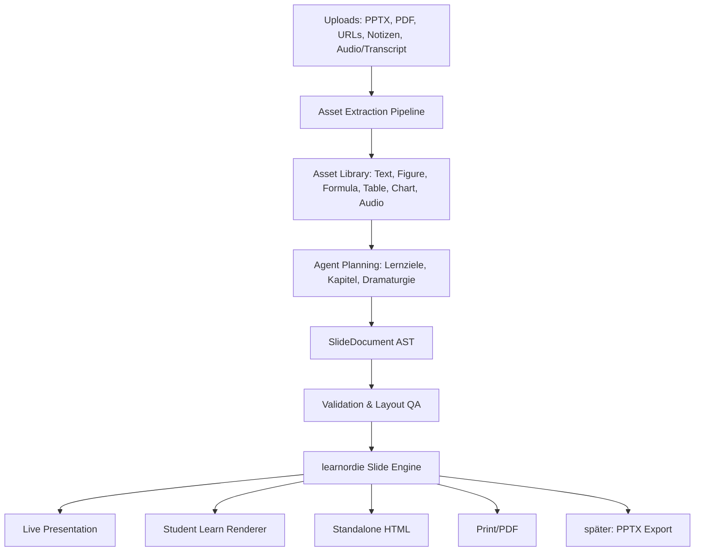

# learnordie Slide Engine Fork & Monorepo Refactor Plan

Stand: 2026-06-24

Dieses Dokument ist der verbindliche Plan, bevor reveal.js geforkt, reduziert und in learnordie.app eingebaut wird. Ziel ist ausdrücklich nicht, eine eigene Präsentationsengine amateurhaft nachzubauen. Ziel ist, den bewährten Kern von reveal.js zu übernehmen, unnötige Teile zu entfernen und darüber ein sicheres, agentenfähiges, responsives Slide-System für learnordie zu bauen.

## 0. Entscheidung

Wir forken reveal.js kontrolliert in das learnordie Produktrepo.

Aber: Wir übernehmen reveal.js nicht als sichtbares Produkt und bauen nicht "Reveal mit Quiz daneben". Wir bauen eine eigene learnordie Slide Engine mit reveal.js als technischem Kern für Präsentationsnavigation, Layout-Skalierung, Keyboard/Touch, Fragments, Speaker Notes und Print/PDF-Grundlagen.

Kanonisches Repository ist das App- und Produktrepo:

- <https://github.com/metric-space-ai/learnordie>

Die Engine ist Teil dieses Repos. Sie ist kein separates Produkt, keine zweite Deployment-Einheit und kein eigenständiges UX-Versprechen.

Die fachliche Wahrheit der Slides ist nicht reveal-Markup und nicht freies HTML. Die fachliche Wahrheit ist ein versioniertes `SlideDocument` im learnordie-Format. Daraus rendern wir:

- Live-Präsentation für Dozierende.
- Live-Ansicht für Studierende.
- Learn-Modus mit Mobile-Reflow, Quiz-Hotspots und KI-Kontext.
- Standalone HTML.
- PDF/Print.
- später optional PPTX-Export.

## 1. Warum Fork im Produktrepo statt Dependency oder separatem Repo

### 1.1 Gründe für den Fork

- Wir brauchen langfristige Kontrolle über die Präsentationsruntime.
- Die Wartung kann durch Agents übernommen werden.
- Wir wollen wenige externe Dependencies.
- Wir wollen nur die Teile behalten, die wirklich gebraucht werden.
- Wir wollen Sicherheits-, Export- und Offline-Anforderungen direkt kontrollieren.
- Wir wollen API und CSS-Kontrakte stabilisieren, statt reveal.js-Upstream-Änderungen ungefiltert in die Produktoberfläche zu lassen.
- Die Engine muss direkt mit App-Routen, Standalone-Export, Asset-Library, Quiz, Learn-Modus und Studio-Editor versioniert werden.
- Ein separates Engine-Repo würde die frühe Produktentwicklung unnötig fragmentieren.

### 1.2 Was nicht passieren darf

- Kein blindes Vendoring des gesamten reveal.js-Projekts.
- Kein separates Produktrepo für die Engine als kanonische Quelle.
- Kein Nachbau einer Slide Engine von Null.
- Kein freies HTML als Hauptdatenmodell.
- Keine direkte Speicherung von unsanitized Agent-HTML in der Datenbank.
- Kein Theme-Zoo und keine Plugin-Wildnis.
- Keine Abhängigkeit davon, dass Desktop-Slides auf Mobile nur klein skaliert werden.

## 2. Quellenstand reveal.js

Aktueller Bezugspunkt:

- Repository: <https://github.com/hakimel/reveal.js/>
- Website/Dokumentation: <https://revealjs.com/>
- Lizenz: MIT
- Aktuell sichtbare Release-Information beim Check: `6.0.1`, 2026-04-11
- Kanonisches Produktrepo: <https://github.com/metric-space-ai/learnordie>
- Engine-Zielpfad im Produktrepo: `packages/slide-engine`
- Upstream-Quelle: `hakimel/reveal.js`
- Hinweis: Ein temporärer externer Fork unter <https://github.com/metric-space-ai/learnordie-slide-engine> wurde während der Analyse angelegt. Er ist nicht die kanonische Produktquelle und wird nur als Zwischenablage/Upstream-Arbeitskopie verwendet, falls wir ihn bewusst behalten.

Relevante reveal.js-Fähigkeiten:

- Markup-Struktur `.reveal > .slides > section`.
- horizontale und vertikale Slides.
- automatische Skalierung anhand einer "normalen" Präsentationsgröße.
- Keyboard- und Touch-Navigation.
- Fragments.
- Speaker Notes.
- Auto-Animate.
- PDF/Print-Modus.
- Math/LaTeX über Plugin-Pfad.
- Code Highlighting über Plugin-Pfad.
- offizielle React-Wrapper-Idee seit reveal.js 6.

Wir nutzen diese Fähigkeiten als Referenz und Kern, aber schneiden die Engine auf learnordie-Bedarf zu.

## 3. Aktueller learnordie-Zustand

Aktuell gibt es nur eine einfache Slide-Schicht:

- `src/components/SlideCanvas.tsx`
- `src/components/Diagram.tsx`
- `Slide`-Typ in `src/lib/types.ts`

Das aktuelle Modell:

```ts
type Slide = {
  id: string;
  eyebrow: string;
  title: string;
  topic: string;
  copy: string[];
  diagram: "bearing" | "formula" | "ramp";
};
```

Das reicht für Demo-/Kernflows, aber nicht für echte Präsentationen. Es fehlen:

- echte Layouts;
- Bilder als Slide-Objekte;
- Tabellen;
- Formeln;
- Diagramme;
- Asset-Referenzen;
- Sprecher-Notizen als Erstklasse-Objekt;
- responsive Mobile-Reflow;
- sichere HTML-Erweiterung;
- Agent-QA gegen Layout-Overflow;
- PowerPoint-Import als editierbare Folienstruktur;
- PowerPoint-/PDF-/HTML-Export als konsistente Zielartefakte.

## 4. Produktziel

Dozierende sollen Materialien beisteuern können. Ein Agent baut daraus eine hochwertige, technische Vorlesungspräsentation. Diese Präsentation muss:

- im Live-Modus wie ein Foliendeck funktionieren;
- im Learn-Modus auf Mobile, Tablet und Desktop sinnvoll nutzbar sein;
- mit Quizfragen, Chat, Transkript und KI-Kontext verbunden sein;
- langfristig als Standalone HTML nutzbar sein;
- reproduzierbar aus strukturierten Daten erzeugt werden;
- manuell korrigierbar bleiben.

## 5. Grundarchitektur



Wichtig: Der Agent erstellt nicht primär PowerPoint-Dateien. Der Agent erstellt ein `SlideDocument`. PowerPoint ist Importquelle und später optional Exportziel, aber nicht die interne Wahrheit.

## 6. SlideDocument als Source of Truth

### 6.1 Top-Level-Schema

```ts
type SlideDocument = {
  schemaVersion: "learnordie.slide.v1";
  id: string;
  title: string;
  language: "de" | "en" | string;
  aspect: "16:9" | "16:10" | "4:3";
  theme: SlideThemeId;
  deckSettings: {
    defaultTransition: "none" | "fade" | "slide";
    showSlideNumbers: boolean;
    allowFragments: boolean;
    mobileMode: "reflow" | "scaled" | "hybrid";
  };
  slides: SlideNode[];
  assets: SlideAssetRef[];
  createdBy: {
    mode: "agent" | "manual" | "import";
    model?: string;
    promptVersion?: string;
  };
};
```

### 6.2 SlideNode

```ts
type SlideNode = {
  id: string;
  title: string;
  layout: SlideLayoutId;
  intent:
    | "title"
    | "concept"
    | "definition"
    | "explanation"
    | "derivation"
    | "example"
    | "comparison"
    | "summary"
    | "quiz"
    | "transition";
  blocks: SlideBlock[];
  speakerNotes?: SpeakerNote[];
  quizAnchors?: QuizAnchor[];
  sourceRefs: SourceReference[];
};
```

### 6.3 Blocktypen

Erlaubte Blocktypen in Version 1:

- `heading`
- `paragraph`
- `bulletList`
- `numberedList`
- `definition`
- `callout`
- `figure`
- `formula`
- `table`
- `chart`
- `process`
- `comparison`
- `code`
- `quote`
- `quizAnchor`
- `spacer`

Keine beliebigen DOM-Nodes im Kernschema.

### 6.4 Beispiel

```json
{
  "id": "slide-stribeck-01",
  "title": "Stribeck-Kurve",
  "layout": "technical_figure_right",
  "intent": "explanation",
  "blocks": [
    {
      "type": "paragraph",
      "text": "Die Reibungszahl hängt von Drehzahl, Viskosität und Last ab."
    },
    {
      "type": "figure",
      "assetId": "asset-stribeck-curve",
      "caption": "Typischer Verlauf der Stribeck-Kurve"
    },
    {
      "type": "formula",
      "latex": "S = \\frac{\\eta \\cdot n}{p}"
    }
  ],
  "quizAnchors": [
    {
      "id": "quiz-stribeck-transfer",
      "level": "1.0",
      "blockId": "asset-stribeck-curve"
    }
  ],
  "sourceRefs": [
    {
      "assetId": "asset-pptx-original",
      "locator": "Folie 18"
    }
  ]
}
```

## 7. Freies HTML

Freies HTML darf es geben, aber nicht als Standardweg.

### 7.1 Standard

Der Agent erzeugt strukturierte Blöcke. Diese Blöcke werden durch React-Komponenten und learnordie-CSS gerendert.

### 7.2 Expert-/Escape-Hatch

Ein Block `htmlSandbox` ist möglich, aber nur unter harten Bedingungen:

- Speicherung als getrennte, markierte Sandbox-Komponente.
- Sanitizing vor Persistenz.
- keine `<script>`-Tags.
- keine `on*` Eventhandler.
- keine externen iframes.
- keine inline JavaScript URLs.
- CSS nur über erlaubte Klassen oder scoped CSS-Variablen.
- Rendering optional in einem iframe mit `sandbox`.
- keine Nutzung in Standalone ohne vorherigen Sicherheitscheck.

### 7.3 Agent-Regel

Agenten dürfen `htmlSandbox` nur verwenden, wenn:

- kein Standardblock das Ziel darstellen kann;
- der Block als `requiresReview: true` markiert wird;
- eine visuelle QA bestanden wurde;
- der Editor den Block als "freies HTML" sichtbar kennzeichnet.

## 8. Asset Library

Die bestehende `lecture_assets`/`asset_chunks`-Logik ist eine gute Basis, aber nicht ausreichend. Wir brauchen eine echte Präsentations-Asset-Ebene.

### 8.1 Assettypen

- `text`
- `figure`
- `photo`
- `diagram`
- `chart`
- `formula`
- `table`
- `audio`
- `video`
- `sourceDocument`

### 8.2 Assetfelder

```ts
type SlideAsset = {
  id: string;
  lectureId: string;
  kind: AssetKind;
  title: string;
  description?: string;
  storageKey?: string;
  previewKey?: string;
  extractedText?: string;
  structuredData?: unknown;
  source: {
    materialId: string;
    originalName: string;
    page?: number;
    slide?: number;
    bbox?: { x: number; y: number; width: number; height: number };
  };
  tags: string[];
  quality: {
    extractionConfidence?: number;
    needsReview: boolean;
    reason?: string;
  };
};
```

### 8.3 PowerPoint-Import

PPTX-Import soll in Phasen erfolgen:

1. Text, Notizen, Chart-Text und Bildpositionen extrahieren.
2. Eingebettete Bilder als separate Assets persistieren.
3. Folienstruktur grob erfassen: Titel, Textboxen, Bilder, Tabellen, Charts.
4. Mapping auf learnordie-Blöcke vorschlagen.
5. Agent entscheidet, was übernommen, zusammengefasst oder neu aufgebaut wird.

Wir versuchen nicht, PowerPoint 1:1 als editierbares Modell nachzubauen. Wir nutzen PowerPoint als Rohmaterial.

### 8.4 PDF-Import

PDF-Import:

1. Text extrahieren.
2. Seitenbilder/Abbildungen erkennen.
3. OCR/visuelle Analyse für nicht getaggte Inhalte.
4. Tabellen/Formeln heuristisch erkennen.
5. Assets mit Seiten- und Positionsbezug speichern.

## 9. Wie der Agent Präsentationen erstellt

Der Agent arbeitet in mehreren kontrollierten Schritten. Kein Single-Shot "mach mal Slides".

### 9.1 Step 1: Materialbriefing

Input:

- extrahierte Assets;
- bestehende Folien;
- Transkript;
- Chatfragen;
- Lernziele;
- Prüfungsdatum;
- Zielniveau;
- Sprache.

Output:

- Themenliste;
- Lernziele;
- benötigte Begriffe;
- erwartete Fehlkonzepte;
- grobe Dramaturgie.

### 9.2 Step 2: Deck Outline

Output:

```json
{
  "sections": [
    {
      "title": "Grundprinzip Gleitlager",
      "learningGoal": "Studierende erklären den Schmierfilmaufbau.",
      "slides": [
        {
          "intent": "concept",
          "workingTitle": "Hydrodynamischer Schmierfilm",
          "requiredAssets": ["asset-oelkeil-diagramm"]
        }
      ]
    }
  ]
}
```

### 9.3 Step 3: SlideDocument Draft

Der Agent erzeugt valide `SlideNode`s. Dabei gelten harte Regeln:

- pro Slide maximal ein Hauptgedanke;
- kurze Titel;
- keine Textwände;
- Quellenreferenzen Pflicht;
- Asset-IDs müssen existieren;
- Tabellen dürfen auf Mobile reflowen;
- Formeln müssen in LaTeX oder MathML vorliegen;
- Abbildungen brauchen Alttext;
- Quizanker müssen einem Slide-Block zugeordnet sein.

### 9.4 Step 4: Layout-Auswahl

Der Agent wählt nur aus einer festen Layout-Bibliothek:

- `title_statement`
- `section_divider`
- `technical_one_column`
- `technical_two_column`
- `technical_figure_right`
- `technical_figure_left`
- `definition_with_example`
- `formula_derivation`
- `table_focus`
- `chart_focus`
- `comparison_split`
- `process_steps`
- `case_study`
- `quiz_transition`

### 9.5 Step 5: Validierung

Automatische Checks:

- Schema gültig.
- Alle Assets vorhanden.
- Keine verbotenen Blocktypen.
- Textlängen innerhalb Layout-Budget.
- Überschriften passen.
- Tabellen haben Mobile-Strategie.
- Formeln sind parsebar.
- Bilder haben Alttext.
- Quellenreferenzen vorhanden.

### 9.6 Step 6: Render-QA

Playwright rendert:

- 1920 x 1080 Desktop;
- 1366 x 768 Laptop;
- 1024 x 768 Tablet;
- 834 x 1194 iPad Portrait;
- 390 x 844 Mobile.

Checks:

- keine horizontalen Overflows;
- keine abgeschnittenen Überschriften;
- keine verdeckten Quiz-Hotspots;
- keine Buttons außerhalb des Viewports;
- keine unlesbaren Formeln;
- Tabellen bleiben bedienbar;
- Bilder laden;
- Console clean;
- bei Standalone keine externen Runtime-Abhängigkeiten.

### 9.7 Step 7: Repair Loop

Wenn QA fehlschlägt:

- Fehler werden slide-genau an den Agenten zurückgegeben.
- Der Agent erzeugt nur betroffene Slides neu.
- Assets bleiben stabil.
- Versionshistorie bleibt nachvollziehbar.

## 10. Monorepo-Zielarchitektur

### 10.1 Repositories

Kanonisch:

- `metric-space-ai/learnordie`

In diesem Repository liegen:

- Next.js App;
- Studio;
- Student-/Lecturer-Flows;
- Datenbank- und Agent-Code;
- Standalone-Exporter;
- Slide Engine;
- reveal.js-Fork-/Vendor-Kern.

Upstream:

- `hakimel/reveal.js`

Nicht-kanonisch:

- `metric-space-ai/learnordie-slide-engine`

Status 2026-06-24: Der externe Fork wurde während der Recherche angelegt. Er darf nicht als Produktrepo behandelt werden. Falls er bestehen bleibt, dient er nur als technische Arbeitskopie für Upstream-Diffs. Die produktive Engine wird im `learnordie` Monorepo entwickelt.

### 10.2 Package-Struktur

```txt
learnordie/
  LICENSE
  NOTICE
  README.md
  src/
    app/
    components/
    lib/
    slide-engine/
      schema.ts
      legacy.ts
      index.ts
  packages/
    slide-engine/
      package.json
      README.md
      LICENSE
      NOTICE
      src/
        reveal-core/
          navigation/
          layout/
          keyboard/
          touch/
          fragments/
          notes/
          print/
        learnordie/
          deck.ts
          slide-document.ts
          renderer.ts
          events.ts
          standalone.ts
          qa-hooks.ts
      styles/
        core.css
        themes/
          learnordie-north.css
          learnordie-technical.css
          learnordie-dark-room.css
      vendor/
        reveal-core/
          UPSTREAM.md
          manifest.json
          src/
      test/
        fixtures/
        playwright/
  scripts/
    slide-engine-qa-contract.mjs
  tests/
    e2e/
      slide-engine-qa.spec.ts
```

### 10.3 Übergangspfad

Der erste Spike darf `src/slide-engine` nutzen, um Schema, Adapter und Renderer in die existierende App zu integrieren. Sobald der Kern stabil ist, wird der wiederverwendbare Runtime-Teil nach `packages/slide-engine` gehoben.

Damit vermeiden wir zwei Fehler gleichzeitig:

- keine separate Engine-Insel außerhalb des Produkts;
- kein unstrukturierter reveal.js-Dump mitten in der App.

Langfristige Grenze:

- `src/slide-engine`: App-Adapter, Legacy-Kompatibilität, Datenbank-/Produktintegration.
- `packages/slide-engine`: generische Runtime, Renderer, CSS-Kontrakt, QA-Hooks, Standalone-Runtime.

### 10.4 Zielstruktur im Package

```txt
packages/slide-engine/
  src/
    reveal-core/
      navigation/
      layout/
      keyboard/
      touch/
      fragments/
      notes/
      print/
    learnordie/
      deck.ts
      slide-document.ts
      renderer.ts
      events.ts
      standalone.ts
      qa-hooks.ts
  styles/
    core.css
    themes/
      learnordie-north.css
      learnordie-technical.css
      learnordie-dark-room.css
  vendor/
    reveal-core/
      UPSTREAM.md
      manifest.json
      src/
  test/
    fixtures/
    playwright/
```

### 10.5 Was aus reveal.js behalten wird

Muss behalten werden:

- Deck-State;
- Navigation horizontal/vertikal;
- Keyboard;
- Touch;
- Fragment-State;
- layout scaling;
- embedded mode;
- speaker notes basis;
- print/PDF support;
- event system.

Optional behalten:

- Auto-Animate;
- overview mode;
- progress;
- slide numbers.

### 10.6 Was entfernt oder nicht übernommen wird

Entfernen oder nicht exportieren:

- Demo-App;
- Theme-Zoo;
- Markdown als Standard-Authoring;
- Multiplex;
- externe Plugin-Beispiele;
- `fitty`-basierter Auto-Fit-Pfad aus reveal.js, falls er eine zusätzliche Runtime-Dependency erzwingen würde;
- alte Browser-Shims;
- globale DOM-Mutationen, soweit für Next/React problematisch;
- unkontrollierte HTML-Plugin-Pfade.

Math/Code bleiben als kontrollierte Module:

- Formelblock über KaTeX/MathJax-Adapter oder serverseitig gerendertes MathML/SVG.
- Codeblock über kontrolliertes Highlighting, nicht beliebige Plugin-Wildnis.

## 11. CSS- und Design-System

Slides bekommen keine beliebigen Styles. Es gibt ein hochwertiges Standard-CSS-System.

### 11.1 Theme-Prinzipien

- hell, technisch, nordisch;
- kein Marketing-Hero-Look;
- keine dekorativen Kartenflächen;
- klare Typografie;
- Formeln und Tabellen zuerst lesbar;
- Abbildungen mit Captions;
- ausreichend Rand für Beamer;
- Mobile-Reflow im Learn-Modus.

### 11.2 CSS-Kontrakt

Alle Slides nutzen:

- CSS Custom Properties;
- Layout-Klassen aus kontrollierter Liste;
- Container Queries, wo sinnvoll;
- feste Aspect-Ratio im Presentation Mode;
- Reflow im Learn Mode.

Keine Agent-generierten globalen Styles.

### 11.3 Standardlayouts

Jedes Layout bekommt:

- Desktop-Regeln;
- Tablet-Regeln;
- Mobile-Reflow-Regeln;
- Textbudget;
- erlaubte Blockkombinationen;
- Screenshot-Fixtures;
- QA-Schwellen.

## 12. Editor-Konzept

Der manuelle Editor wird kein Formularlisten-Editor.

### 12.1 WYSIWYG-Regeln

- Text direkt auf dem Slide bearbeiten.
- Block auswählen und rechts/unterhalb kontextnah bearbeiten.
- Layout wechseln, ohne Inhalt zu verlieren.
- Asset austauschen.
- Formel editieren.
- Tabelle editieren.
- Quizanker setzen.
- Speaker Notes öffnen.
- Agent-Vorschläge als Review-Diff anzeigen.

### 12.2 Editor-Modi

- `design`: Slide-Inhalte und Layout.
- `sources`: Asset- und Quellenbezug.
- `quiz`: Frageanker und Schwierigkeitsniveau.
- `notes`: Sprecher-Notizen.
- `qa`: Layout- und Accessibility-Fehler.

## 13. Standalone HTML

Standalone Export muss ohne Server lauffähig bleiben.

Inhalt:

- SlideDocument JSON;
- gerenderte Slides;
- CSS;
- minimale Engine-Runtime;
- Quizdaten;
- ggf. Audio;
- statische KI-Erklärungen, falls vorhanden;
- Manifest mit Checksums.

Nicht enthalten:

- API Keys;
- Live-LLM-Zugriff;
- externe Fonts ohne Einbettung;
- externe Bilder;
- Tracking.

## 14. PPTX-Export

PPTX-Export ist nicht Phase 1.

Wenn erforderlich, ist der saubere Weg:

1. `SlideDocument` bleibt Wahrheit.
2. Ein separater Exporter mappt learnordie-Blöcke auf OOXML.
3. Nur unterstützte Layouts werden exportiert.
4. Unsupported Blocks bekommen Fallback als Bild oder Notiz.
5. Export-QA öffnet/validiert PPTX-Struktur.

Wir sollten nicht versuchen, beliebiges HTML automatisch perfekt nach PPTX zurückzuübersetzen.

## 15. Migration aus aktuellem System

### 15.1 Kompatibilitätsschicht

Der bestehende `Slide`-Typ wird zunächst in `SlideDocument` übersetzt:

```ts
function legacySlideToSlideNode(slide: Slide): SlideNode {
  return {
    id: slide.id,
    title: slide.title,
    layout: "technical_figure_right",
    intent: "concept",
    blocks: [
      { type: "heading", text: slide.title },
      ...slide.copy.map((text) => ({ type: "paragraph", text })),
      { type: "figure", assetId: `legacy-diagram-${slide.diagram}` }
    ],
    sourceRefs: []
  };
}
```

### 15.2 Rollout

1. Engine neben `SlideCanvas` einführen.
2. Demo-Lecture via Adapter rendern.
3. Learn-Modus und Student-Live auf neue Engine umstellen.
4. Lecturer-Live umstellen.
5. Studio-Editor umstellen.
6. Standalone Export umstellen.
7. Alten `SlideCanvas` entfernen.

## 16. Parallelisierbare Subagent-Tracks

### Track A: Monorepo Fork Carving

Ziel: reveal.js-Fork reduzieren und als `packages/slide-engine` im learnordie Monorepo lauffähig machen.

Deliverables:

- Package-Struktur im `metric-space-ai/learnordie` Monorepo angelegt.
- Upstream-Bezug zu `hakimel/reveal.js` dokumentiert.
- Import-/Sync-Skript oder dokumentierter Vendor-Prozess für reveal.js-Kernmodule.
- MIT-Lizenz/NOTICE korrekt.
- minimale Build-Pipeline.
- Kernmodule isoliert.
- nicht benötigte Plugins/Demos entfernt.
- erste Browser-Fixture rendert 3 Slides.

### Track B: SlideDocument Schema

Ziel: Versioniertes Schema, TypeScript-Typen und Zod-Validatoren.

Deliverables:

- `SlideDocument`-Typen.
- Zod-Schema.
- Migrationsadapter vom alten `Slide`.
- Fehlerformat für Agent Repair Loop.
- Fixture-Decks.

### Track C: Renderer & Theme

Ziel: learnordie-Renderer mit kontrollierten Blocks und hochwertigen Layouts.

Deliverables:

- Block-Komponenten.
- 12 Standardlayouts.
- 3 Themes.
- Desktop/Tablet/Mobile-Regeln.
- Overflow-Guards.

### Track D: Asset Library

Ziel: echte Asset-Entitäten für Bilder, Tabellen, Formeln, Charts.

Deliverables:

- DB-Migration.
- Asset-Typen.
- Upload-/Extraction-Erweiterung.
- Preview/Thumbnail.
- Asset-Quelle/Provenienz.
- UI im Studio.

### Track E: Agent Pipeline

Ziel: Agent erzeugt aus Material ein validiertes SlideDocument.

Deliverables:

- Prompt-Vertrag.
- Materialbriefing.
- Outline-Generation.
- SlideDocument-Generation.
- Repair-Loop.
- QA-Fehlerfeedback.

### Track F: Manual Editor

Ziel: blocknaher WYSIWYG-Editor.

Deliverables:

- Inline-Textbearbeitung.
- Block-Auswahl.
- Layoutwechsel.
- Asset-Picker.
- Formel-/Tabelleneditor.
- Quizanker-Editor.

### Track G: Export & Compatibility

Ziel: Standalone/PDF/PPTX-Pfade.

Deliverables:

- Standalone HTML mit neuer Engine.
- Print/PDF.
- Exportmanifest.
- später PPTX-Exporter.

### Track H: QA & Production Gates

Ziel: harte Browser-/Layout-Gates.

Deliverables:

- Playwright-Viewport-Matrix.
- Overflow-Scanner.
- Screenshot-Diffs.
- Console-/Network-Gates.
- Standalone-offline-Gate.
- Migration-E2E.

## 17. Akzeptanzkriterien

Eine erste Version gilt nur als production-ready, wenn:

1. Ein Agent aus bereitgestellten Quellen ein valides `SlideDocument` erzeugt.
2. Das Deck auf Desktop, Tablet und Mobile ohne Overflow rendert.
3. Learn-Modus nutzt Mobile-Reflow, nicht nur Downscaling.
4. Quiz-Hotspots bleiben korrekt an Slides/Blocks verankert.
5. Standalone Export funktioniert offline.
6. Der Editor kann mindestens Text, Layout, Bildasset, Formel und Quizanker ändern.
7. Sicherheitscheck blockiert unsicheres HTML.
8. Alte Demo-Lectures rendern über den Legacy-Adapter.
9. Playwright-E2E deckt Live, Learn, Studio und Standalone ab.
10. Der reveal.js-Kern im Monorepo enthält nur dokumentiert benötigte Teile.

## 18. Risiken

### 18.1 Reveal-Upstream driftet

Risiko: Upstream-Fixes werden übersehen.

Mitigation:

- Upstream-Quelle und importierten Commit dokumentieren.
- quartalsweise Diff-Audit.
- Security-Fixes priorisieren.
- lokale Änderungen klein und dokumentiert halten.

### 18.2 Mobile wird nur skaliert

Risiko: Präsentationsmodus funktioniert, Learn-Modus nicht.

Mitigation:

- getrennte Renderer für Presentation und Learn.
- Mobile-Reflow im Schema explizit abbilden.
- Mobile-Playwright-Gates verpflichtend.

### 18.3 Agent erzeugt schlechte Slides

Risiko: formal gültig, didaktisch schlecht oder optisch überladen.

Mitigation:

- Textbudgets.
- Layoutbudgets.
- Lernzielprüfung.
- Agent Repair Loop.
- Dozentenreview.

### 18.4 Freies HTML wird Sicherheitsloch

Risiko: XSS oder kaputte Standalone-Exports.

Mitigation:

- Standard nur AST-Blöcke.
- Sandbox-Block als Ausnahme.
- Sanitizing.
- CSP.
- iframe sandbox optional.
- `requiresReview`.

### 18.5 Asset-Extraktion überschätzt

Risiko: PDF/PPTX-Import wirkt wie Vollimport, ist aber nur heuristisch.

Mitigation:

- UI unterscheidet Quelle, extrahiertes Asset, geprüftes Asset.
- Confidence und Reviewstatus.
- keine automatische Behauptung "PowerPoint vollständig importiert".

## 19. Konkrete erste Implementierungswelle

### Welle 1: Planbarer Engine-Spike

1. `packages/slide-engine` im `metric-space-ai/learnordie` Monorepo anlegen.
2. reveal.js-Upstream-Commit und Importprozess dokumentieren.
3. Minimaldeck mit Navigation, Scaling, Keyboard, Touch rendern.
4. learnordie Theme CSS hinzufügen.
5. `SlideDocument` v1 im App-Repo einführen.
6. Legacy-Adapter für aktuelle Demo-Slides bauen.
7. `SlideEngineCanvas` neben `SlideCanvas` bauen.
8. Playwright: Desktop/Mobile Render-Smoke.

### Welle 2: Produktintegration

1. Student Live auf `SlideEngineCanvas` umstellen.
2. Learn-Modus auf `SlideEngineCanvas` mit Mobile-Reflow umstellen.
3. Lecturer Live umstellen.
4. Standalone Export umstellen.
5. Alte Engine entfernen, wenn Tests grün.

### Welle 3: Agent und Assets

1. Asset-Library-Migration.
2. PPTX/PDF-Extraktion in echte Assets erweitern.
3. Agent erzeugt `SlideDocument`.
4. Agent-QA/Repair Loop.
5. Studio zeigt SlideDocument blocknah editierbar.

## 20. Nicht verhandelbare Engineering-Regeln

- Jede neue Slide-Funktion braucht einen Browser-Test.
- Kein "sieht auf meinem Desktop gut aus" ohne Mobile-Gate.
- Kein unsicheres HTML ohne Sandbox-Status.
- Kein Agent-Output ohne Schema-Validation.
- Kein Import ohne Quellen-/Provenienzbezug.
- Kein Fork ohne Upstream-Tracking und Lizenznotiz.
- Kein Entfernen bestehender Live-/Learn-Funktionalität ohne E2E-Ersatz.

## 21. Ergebnisdefinition

Am Ende dieser Initiative besitzt learnordie:

- eine eigene, kontrollierte Slide Engine;
- einen reduzierten reveal.js-Fork als bewährten Präsentationskern;
- ein sicheres SlideDocument-Format;
- eine Asset-Library für wiederverwendbare Inhalte;
- einen Agentenpfad zur Deck-Erstellung;
- einen manuellen, foliennahen Editor;
- responsive Renderer für Präsentation und Learn-Modus;
- robuste Standalone-Exports.

Das ist der Unterschied zwischen "Slides irgendwie als HTML anzeigen" und einer echten Produktionsgrundlage für KI-generierte technische Vorlesungen.
